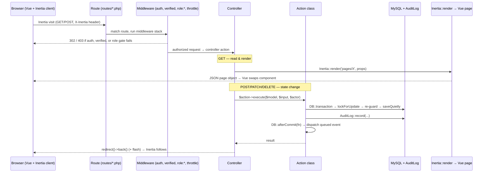

# Architecture

How a SchuLyf request flows from the browser to a rendered Vue page, the stack that makes
it happen, where the code lives, and the handful of patterns every feature reuses.

> See also: [Routes & endpoints](routes.md) · [Data model](data-model.md) ·
> [Security](security.md) · [ADRs](adr/README.md). This page links to those rather than
> repeating them.

## The stack

| Layer | Technology | Role |
|---|---|---|
| Runtime | PHP 8.4, Laravel 13 | Application framework |
| Auth backend | Laravel Fortify v1 | Login, registration, reset, email verification, 2FA |
| SPA bridge | Inertia.js v3 (`inertiajs/inertia-laravel`, `@inertiajs/vue3`) | Server-routed SPA — controllers return Vue pages, no Blade views, no REST client |
| Frontend | Vue 3 + TypeScript, Vite 8 | Pages in `resources/js/pages` |
| UI kit | PrimeVue v4 + **Aura** preset, Tailwind CSS v4 (`tailwindcss-primeui`) | New UI; starter-kit shadcn-vue primitives coexist on un-migrated pages |
| Typed routes | Laravel Wayfinder (`@/actions`, `@/routes`) | Generated TS route/controller helpers — no hardcoded URLs |
| Database | MySQL (`student_management`) | Single institution per install |
| Cache | File locally; Redis via `predis` in prod | Reference-data read-through cache (#39) |
| Queue | `database` connection | Queued mail + notification listeners |
| Tests | Pest v4 (`tests/Feature`, `tests/Browser`) | See [Testing](testing.md) |

Icons are `lucide-vue-next` (PrimeIcons is intentionally not installed). Branding is the
**SchuLyf** emerald design system; the app name is set via `APP_NAME` / `VITE_APP_NAME`.

## Request lifecycle

A page navigation is an Inertia visit: an XHR that returns a JSON page object
(`{ component, props, url, version }`), which the client renders by swapping the Vue page
component — no full reload. The server side is ordinary Laravel routing.



Read requests render directly. **Every state change goes through an Action class** (next
section). The JSON lookup endpoints under `api/v1` (cascading-dropdown data for the
application form) are the exception to the "render a page" rule — they return plain JSON to
`fetch()` calls, but they are still session-authenticated web routes, not a token API.

## Directory map

```
app/
  Actions/        # one class per state change, grouped by role/domain
  Concerns/       # cross-cutting traits (e.g. NormalizesPhoneNumbers)
  Console/        # Commands (PruneAuditLogs) + scheduled tasks
  Enums/          # backed enums — the source of truth for every string-status column
  Events/         # domain events (PaymentReviewed, CourseSessionChanged, ...)
  Http/
    Controllers/  # thin: validate, call an Action or render, redirect
    Middleware/   # EnsureUserHasRole (role:* alias), HandleInertiaRequests, ...
    Requests/     # FormRequest validation
    Responses/    # LoginResponse (role-priority redirect)
  Listeners/      # queued ShouldQueue listeners → mail + notifications
  Mail/           # Mailables (decision, invitation, ...)
  Models/         # Eloquent models; Concerns/RecordsAudit lives here
  Notifications/  # Laravel Notifications (mail + database channels)
  Providers/      # AppServiceProvider (gates, audit listeners), FortifyServiceProvider
  Services/       # PaymentStandingService, ReferenceDataCache, ...
resources/js/
  pages/          # Inertia/Vue page components (resolved by name)
  layouts/        # AppLayout, AuthLayout, settings/Layout (auth/settings lazy-loaded)
  components/     # shared Vue components (FileViewerDialog, StatCard, AppSidebarNav, ...)
  actions/, routes/, wayfinder/   # Wayfinder-generated typed helpers
  app.ts          # Inertia + Vue + PrimeVue bootstrap
routes/           # web, settings, admin, sao, lecturer, student, accountant, console
database/
  migrations/     # string columns + enum casts; softDeletes everywhere except audit_logs
  factories/, seeders/
```

## Core patterns

### 1. Action classes for every state change

Reads render. Writes are encapsulated in a single-purpose class in `app/Actions/`, invoked
by a thin controller. The canonical hardened shape —
[`app/Actions/Accountant/ReviewPaymentAction.php`](../app/Actions/Accountant/ReviewPaymentAction.php) —
combines five guards that every state-changing Action follows:

| Step | Why |
|---|---|
| `DB::transaction(...)` | All writes (status + side-effect rows like the receipt) commit or roll back atomically. |
| `lockForUpdate()` re-fetch inside the transaction | A concurrent reviewer can't double-decide past a stale read (AUD-001). |
| Terminal-status re-guard (`isTerminal()`) | A row already in a final state throws `ValidationException` rather than being re-decided. |
| `saveQuietly()` + explicit `AuditLog::record(...)` | The write is logged with the **actor's** id and a precise change payload, bypassing the model-event audit so the entry is deliberate, not duplicated. |
| `DB::afterCommit(fn () => event(...))` | The queued event (mail / notification) fires only after the transaction commits, never on a row that rolled back. |

New Actions mirror this. The SAO decision flow
(`app/Actions/Sao/DecideApplicationAction.php`), attendance
(`Lecturer/MarkAttendance`), grading, deferral review, and dispute resolution all follow it.

### 2. Authorization: role middleware + ownership

Authorization is two layers, both concrete (there is no ability-gate registry — the gates were
retired in [ADR-0025](adr/0025-retire-ability-gates.md)):

- **`role:*` route middleware** (`EnsureUserHasRole`, registered in `bootstrap/app.php`) — the coarse
  role gate on every protected route group (`role:admin`, `role:sao,admin`, `role:lecturer`, …);
  `abort_unless($user->hasAnyRole($required), 403)`.
- **Per-resource ownership checks** in the controller/Action (e.g. a lecturer only marks attendance
  for their own course via `authorizeOwnership()`) — the fine-grained layer.

Full detail in [Security](security.md).

### 3. Immutable audit log

The [`RecordsAudit`](../app/Models/Concerns/RecordsAudit.php) trait hooks a model's
`created` / `updated` / `deleted` / `restored` events and writes an `AuditLog` row — a full
attribute snapshot on create/delete/restore, a before/after diff on update. Sensitive fields
(`password`, `two_factor_*`) are redacted; housekeeping fields (timestamps) are excluded.
Non-Eloquent events (login success/fail/logout in `AppServiceProvider`, and the deliberate
Action-level writes above) call `AuditLog::record(...)` directly. `audit_logs` is the one
domain table with **no soft deletes** — records are never updated or deleted. Retention is a
2-year prune (`PruneAuditLogs`, scheduled daily). See [Security](security.md).

### 4. String column + PHP backed-enum cast (never native `ENUM`)

Any column with a fixed value set is declared `string` in the migration and cast to a backed
enum in `app/Enums/`; the enum is the source of truth, validation uses `Rule::enum(...)`.
There are **no native `ENUM`** columns — they are painful to evolve and duplicate the value
list. Course-management enums emit lowercase `->value`; align Vue comparisons to match.

### 5. Session-auth web routes vs `api/v1` same-origin JSON

There is **no `routes/api.php`**. Every route is a session-authenticated web route, split by
audience so each file carries one middleware group:

| File | Audience / prefix |
|---|---|
| `routes/web.php` | Public (`/` → login, public receipt verify), applicant funnel, per-role dashboards, file view/download routes, the `api/v1` lookup group |
| `routes/settings.php` | Self-service profile/security settings |
| `routes/admin.php` | `admin/` prefix, `role:admin` group — references, users, fees, audit-log modal |
| `routes/sao.php`, `routes/lecturer.php`, `routes/student.php`, `routes/accountant.php` | Per-role feature surfaces |

The `api/v1` group inside `web.php` (`program-offerings`, `level-requirements`) serves the
cascading-dropdown lookups as same-origin `fetch()` JSON — session-authenticated and
`throttle:lookups`-limited, **not** a token API. Follow this convention for new
applicant-facing JSON endpoints. Full inventory in [Routes & endpoints](routes.md).

## Auth & rendering wiring

- **Login resolver** — `FortifyServiceProvider::configureAuthentication()` accepts four
  identifiers in one query (email, `employee_id`, `phone`, `student_profiles.matricule`) and
  hashes a dummy password on the not-found path so timing can't enumerate accounts.
- **Post-login redirect** — `App\Http\Responses\LoginResponse` routes by role priority
  (Admin > SAO > Accountant > Lecturer > Student > Applicant).
- **Page resolution** — `resources/js/app.ts` boots Inertia + Vue + PrimeVue (Aura,
  `darkModeSelector: '.dark'`). `AppLayout` is the default; `auth/` and `settings/` layouts
  are lazy-loaded; the receipt/verify pages render layout-less. Per
  [AUD-020](adr/README.md), **PrimeVue components are imported per page** — only
  `ToastService` and the `tooltip` directive are registered app-wide.
