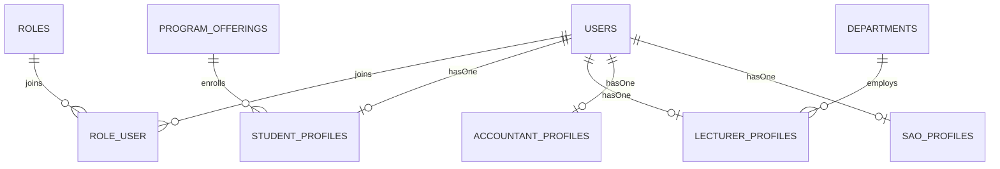
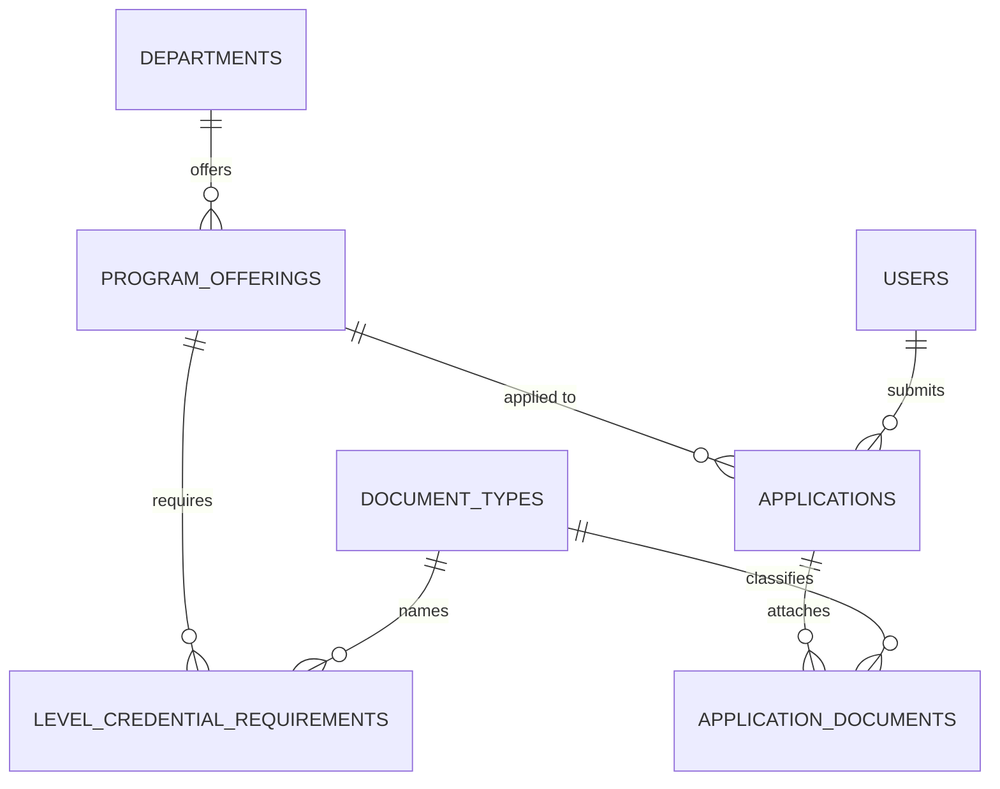
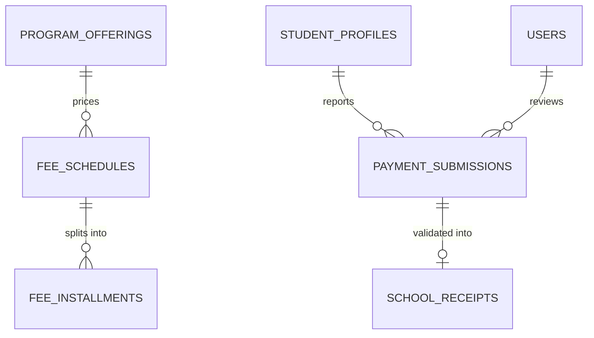
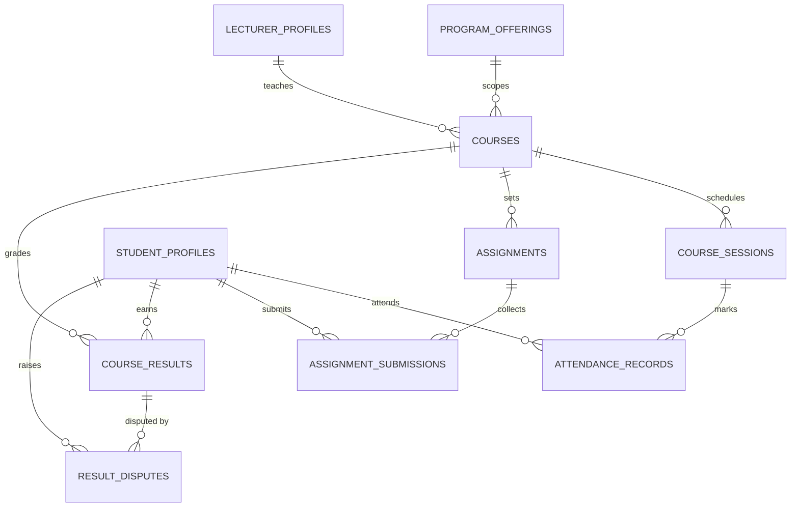

# Data model

Schema reference for SchuLyf, extracted from `database/migrations/` (final state) and the
`app/Models/` Eloquent models. This page is **structure only** — for the behaviour that reads and
writes these tables, follow the linked module docs.

- **Driver:** MySQL (`student_management`).
- **24 domain models** + the `role_user` pivot. Three counter tables (`matricule_sequences`,
  `receipt_sequences`, `notifications`) and the framework tables (`users`/`sessions`/`cache`/`jobs`)
  round out the schema.
- **Conventions used across the codebase**
  - **Enum-as-string:** status/type columns are `string` in the DB and carry an Eloquent enum cast to
    an `App\Enums\*` class — never a native `ENUM`. Every such column below links to its enum.
  - **SoftDeletes:** a `deleted_at` column + the `SoftDeletes` trait; noted per table.
  - **`RecordsAudit`:** model trait that writes an immutable `audit_logs` row on
    `created`/`updated`/`deleted`/`restored`. See [Audit](#audit) and `app/Models/Concerns/RecordsAudit.php`.
  - **Immutability guards:** `AuditLog` and `SchoolReceipt` throw on any Eloquent `updating`/`deleting`.
  - **`restrictOnDelete` / `cascadeOnDelete`:** noted per FK below — load-bearing for delete behaviour.
  - **`#[Fillable(...)]`:** mass-assignable attributes are declared with the PHP attribute on each model.

## Bounded contexts

| Context | Tables |
|---|---|
| [Identity & roles](#identity--roles) | `users`, `roles`, `role_user`, `student_profiles`, `lecturer_profiles`, `accountant_profiles`, `sao_profiles`, `matricule_sequences` |
| [Admissions](#admissions) | `departments`, `program_offerings`, `document_types`, `level_credential_requirements`, `applications`, `application_documents` |
| [Payments & receipts](#payments--receipts) | `fee_schedules`, `fee_installments`, `payment_submissions`, `school_receipts`, `receipt_sequences` |
| [Exam gating & deferrals](#exam-gating--deferrals) | `tuition_deferrals` (+ derived `PaymentStanding`) |
| [Courses](#courses) | `courses`, `course_sessions`, `attendance_records`, `assignments`, `assignment_submissions`, `course_results`, `result_disputes` |
| [Notifications](#notifications) | `notifications` |
| [Audit](#audit) | `audit_logs` |

---

## Identity & roles

Behaviour: [Admin user management](modules/admin-user-management.md).

### `users`
SoftDeletes. `RecordsAudit`. Traits: `Notifiable`, `TwoFactorAuthenticatable`. Fillable: `name`, `email`, `phone`, `password`.

| Column | Type | Null? | Cast | Notes |
|---|---|---|---|---|
| `id` | bigint PK | no | | |
| `name` | string | no | | |
| `email` | string | no | | unique; Fortify login identifier (lowercased) |
| `employee_id` | string | yes | | unique; staff identifier (B9) |
| `phone` | string | yes | | unique; optional secondary login identifier (B9) |
| `email_verified_at` | timestamp | yes | `datetime` | |
| `password` | string | no | `hashed` | hidden; redacted in audit diffs |
| `two_factor_secret` | text | yes | | hidden; redacted in audit |
| `two_factor_recovery_codes` | text | yes | | hidden; redacted in audit |
| `two_factor_confirmed_at` | timestamp | yes | `datetime` | |
| `remember_token` | string | yes | | hidden |
| `created_at` / `updated_at` | timestamp | yes | | |
| `deleted_at` | timestamp | yes | | SoftDeletes |

Relations: `roles` (belongsToMany via `role_user`), `studentProfile` / `lecturerProfile` / `accountantProfile` / `saoProfile` (hasOne).

### `roles`
SoftDeletes. `RecordsAudit`. Fillable: `name`.

| Column | Type | Null? | Cast | Notes |
|---|---|---|---|---|
| `id` | bigint PK | no | | |
| `name` | string | no | [`RoleName`](#enum-rolename) | unique |
| `created_at` / `updated_at` | timestamp | yes | | |
| `deleted_at` | timestamp | yes | | SoftDeletes |

### `role_user` (pivot)
User↔Role join table (`withTimestamps`).

| Column | Type | Null? | Notes |
|---|---|---|---|
| `id` | bigint PK | no | |
| `user_id` | FK→`users` | no | **restrictOnDelete** |
| `role_id` | FK→`roles` | no | **restrictOnDelete** |
| `created_at` / `updated_at` | timestamp | yes | |
| | | | unique(`user_id`,`role_id`) |

### `student_profiles`
SoftDeletes. `RecordsAudit`. Fillable: `user_id`, `matricule`, `program_offering_id`, `level`, `academic_year`, `enrolled_at`, `status`.

| Column | Type | Null? | Cast | Notes |
|---|---|---|---|---|
| `id` | bigint PK | no | | |
| `user_id` | FK→`users` | no | | unique; **restrictOnDelete** |
| `matricule` | string | no | | unique; lowercased on set; format `stm-{year}-{0000}` |
| `program_offering_id` | FK→`program_offerings` | no | | **restrictOnDelete**; relation resolves `withTrashed` |
| `level` | tinyint | no | `integer` | |
| `academic_year` | string | no | | |
| `enrolled_at` | date | no | `date` | |
| `status` | string | no | [`StudentStatus`](#enum-studentstatus) | default `active`; indexed |
| `created_at` / `updated_at` | timestamp | yes | | |
| `deleted_at` | timestamp | yes | | SoftDeletes |

### `lecturer_profiles`
SoftDeletes. `RecordsAudit`. Fillable: `user_id`, `department_id`, `specialization`, `hired_at`.

| Column | Type | Null? | Cast | Notes |
|---|---|---|---|---|
| `id` | bigint PK | no | | |
| `user_id` | FK→`users` | no | | unique; **restrictOnDelete** |
| `department_id` | FK→`departments` | no | | **restrictOnDelete** |
| `specialization` | string | yes | | |
| `hired_at` | date | yes | `date` | |
| `created_at` / `updated_at` | timestamp | yes | | |
| `deleted_at` | timestamp | yes | | SoftDeletes |

### `accountant_profiles`
SoftDeletes. `RecordsAudit`. Fillable: `user_id`, `bank_desk`, `cashier_window`.

| Column | Type | Null? | Notes |
|---|---|---|---|
| `id` | bigint PK | no | |
| `user_id` | FK→`users` | no | unique; **restrictOnDelete** |
| `bank_desk` | string | yes | |
| `cashier_window` | string | yes | |
| `created_at` / `updated_at` | timestamp | yes | |
| `deleted_at` | timestamp | yes | SoftDeletes |

### `sao_profiles`
SoftDeletes. `RecordsAudit`. Fillable: `user_id`, `scope`.

| Column | Type | Null? | Notes |
|---|---|---|---|
| `id` | bigint PK | no | |
| `user_id` | FK→`users` | no | unique; **restrictOnDelete** |
| `scope` | string | yes | |
| `created_at` / `updated_at` | timestamp | yes | |
| `deleted_at` | timestamp | yes | SoftDeletes |

### `matricule_sequences` (counter)
No model — written via the query builder by `StudentProfile::nextMatriculeForYear()`. No timestamps, no soft deletes.

| Column | Type | Null? | Notes |
|---|---|---|---|
| `year` | smallint PK | no | one row per admission year |
| `last_number` | int | no | default 0; `lockForUpdate` on issue |

---

## Admissions

Behaviour: [Admissions](modules/admissions.md).

### `departments`
SoftDeletes. `RecordsAudit`. Fillable: `name`, `code`, `description`.

| Column | Type | Null? | Notes |
|---|---|---|---|
| `id` | bigint PK | no | |
| `name` | string | no | unique |
| `code` | string | no | unique |
| `description` | text | yes | |
| `created_at` / `updated_at` | timestamp | yes | |
| `deleted_at` | timestamp | yes | SoftDeletes |

### `program_offerings`
SoftDeletes. `RecordsAudit`. Fillable: `department_id`, `degree_program`, `min_level`, `max_level`.

| Column | Type | Null? | Cast | Notes |
|---|---|---|---|---|
| `id` | bigint PK | no | | |
| `department_id` | FK→`departments` | no | | **restrictOnDelete** |
| `degree_program` | string | no | [`DegreeProgram`](#enum-degreeprogram) | indexed |
| `min_level` | tinyint | no | `integer` | |
| `max_level` | tinyint | no | `integer` | |
| `created_at` / `updated_at` | timestamp | yes | | |
| `deleted_at` | timestamp | yes | | SoftDeletes |
| | | | | unique(`department_id`,`degree_program`) |

### `document_types`
SoftDeletes. `RecordsAudit`. Fillable: `name`, `code`, `description`. `PROTECTED_CODES = ['NID','BIRTH']` (cannot be deleted/renamed).

| Column | Type | Null? | Notes |
|---|---|---|---|
| `id` | bigint PK | no | |
| `name` | string | no | unique |
| `code` | string | no | unique |
| `description` | text | yes | |
| `created_at` / `updated_at` | timestamp | yes | |
| `deleted_at` | timestamp | yes | SoftDeletes |

### `level_credential_requirements`
SoftDeletes. `RecordsAudit`. Fillable: `program_offering_id`, `level`, `document_type_id`, `required`, `notes`.

| Column | Type | Null? | Cast | Notes |
|---|---|---|---|---|
| `id` | bigint PK | no | | |
| `program_offering_id` | FK→`program_offerings` | no | | **restrictOnDelete** |
| `level` | tinyint | no | `integer` | |
| `document_type_id` | FK→`document_types` | no | | **restrictOnDelete** |
| `required` | boolean | no | `boolean` | default true |
| `notes` | text | yes | | |
| `created_at` / `updated_at` | timestamp | yes | | |
| `deleted_at` | timestamp | yes | | SoftDeletes |
| | | | | unique(`program_offering_id`,`level`,`document_type_id`) |

### `applications`
SoftDeletes. `RecordsAudit`. Fillable: `user_id`, `program_offering_id`, `level`, `first_name`, `last_name`, `contact_email`, `phone`, `date_of_birth`, `previous_institute`, `status`, `submitted_at`, `decided_at`, `decided_by_user_id`, `decision_notes`.

| Column | Type | Null? | Cast | Notes |
|---|---|---|---|---|
| `id` | bigint PK | no | | |
| `user_id` | FK→`users` | no | | **restrictOnDelete**; relation `applicant()` |
| `program_offering_id` | FK→`program_offerings` | no | | **restrictOnDelete**; resolves `withTrashed` |
| `level` | tinyint | no | `integer` | |
| `first_name` | string | no | | |
| `last_name` | string | no | | |
| `contact_email` | string | no | | |
| `phone` | string | no | | |
| `date_of_birth` | date | no | `date` | |
| `previous_institute` | string | yes | | |
| `status` | string | no | [`ApplicationStatus`](#enum-applicationstatus) | default `draft` |
| `submitted_at` | timestamp | yes | `datetime` | |
| `decided_at` | timestamp | yes | `datetime` | |
| `decided_by_user_id` | FK→`users` | yes | | nullOnDelete; relation `decidedBy()` |
| `decision_notes` | text | yes | | |
| `created_at` / `updated_at` | timestamp | yes | | |
| `deleted_at` | timestamp | yes | | SoftDeletes |
| | | | | index(`status`,`submitted_at`), index(`user_id`,`status`) |

### `application_documents`
SoftDeletes. `RecordsAudit`. Fillable: `application_id`, `document_type_id`, `file_path`, `original_filename`, `mime_type`, `size_bytes`, `uploaded_at`.

| Column | Type | Null? | Cast | Notes |
|---|---|---|---|---|
| `id` | bigint PK | no | | |
| `application_id` | FK→`applications` | no | | **restrictOnDelete** |
| `document_type_id` | FK→`document_types` | no | | **restrictOnDelete** |
| `file_path` | string | no | | path on default disk |
| `original_filename` | string | no | | |
| `mime_type` | string | no | | |
| `size_bytes` | int | no | `integer` | |
| `uploaded_at` | timestamp | no | `datetime` | |
| `created_at` / `updated_at` | timestamp | yes | | |
| `deleted_at` | timestamp | yes | | SoftDeletes |
| | | | | unique(`application_id`,`document_type_id`) |

---

## Payments & receipts

Behaviour: [Payments & receipts](modules/payments.md).

### `fee_schedules`
SoftDeletes. `RecordsAudit`. Fillable: `program_offering_id`, `level`, `academic_year`, `total_xaf`.

| Column | Type | Null? | Cast | Notes |
|---|---|---|---|---|
| `id` | bigint PK | no | | |
| `program_offering_id` | FK→`program_offerings` | no | | **restrictOnDelete** |
| `level` | tinyint | no | `integer` | |
| `academic_year` | string | no | | |
| `total_xaf` | int | no | `integer` | total tuition in XAF |
| `created_at` / `updated_at` | timestamp | yes | | |
| `deleted_at` | timestamp | yes | | SoftDeletes |
| | | | | unique(`program_offering_id`,`level`,`academic_year`) |

### `fee_installments`
No soft deletes — children of `fee_schedules`, synced as a set. No `RecordsAudit`. Fillable: `fee_schedule_id`, `sequence`, `label`, `amount_xaf`, `due_date`.

| Column | Type | Null? | Cast | Notes |
|---|---|---|---|---|
| `id` | bigint PK | no | | |
| `fee_schedule_id` | FK→`fee_schedules` | no | | **cascadeOnDelete** |
| `sequence` | tinyint | no | `integer` | milestone order |
| `label` | string | no | | |
| `amount_xaf` | int | no | `integer` | |
| `due_date` | date | no | `date` | |
| `created_at` / `updated_at` | timestamp | yes | | |
| | | | | unique(`fee_schedule_id`,`sequence`) |

### `payment_submissions`
SoftDeletes. `RecordsAudit`. Fillable: `student_profile_id`, `academic_year`, `bank`, `amount_xaf`, `bank_reference`, `slip_path`, `slip_original_filename`, `slip_mime_type`, `status`, `reviewed_by`, `reviewed_at`, `rejection_reason`.

| Column | Type | Null? | Cast | Notes |
|---|---|---|---|---|
| `id` | bigint PK | no | | |
| `student_profile_id` | FK→`student_profiles` | no | | **restrictOnDelete** |
| `academic_year` | string | no | | snapshotted from enrollment |
| `bank` | string | no | [`Bank`](#enum-bank) | deposit institution |
| `amount_xaf` | int | no | `integer` | |
| `bank_reference` | string | no | | |
| `slip_path` | string | no | | uploaded bank slip on default disk |
| `slip_original_filename` | string | no | | |
| `slip_mime_type` | string | no | | |
| `status` | string | no | [`PaymentStatus`](#enum-paymentstatus) | default `submitted` |
| `reviewed_by` | FK→`users` | yes | | nullOnDelete; relation `reviewer()` |
| `reviewed_at` | timestamp | yes | `datetime` | |
| `rejection_reason` | text | yes | | |
| `created_at` / `updated_at` | timestamp | yes | | |
| `deleted_at` | timestamp | yes | | SoftDeletes |
| | | | | index(`status`,`created_at`), index(`student_profile_id`,`status`) |

### `school_receipts`
**Immutable** — model blocks `updating`/`deleting`. No timestamps (`issued_at` only). No soft deletes, no `RecordsAudit`. Fillable: `payment_submission_id`, `receipt_number`, `amount_xaf`, `signature`, `issued_at`.

| Column | Type | Null? | Cast | Notes |
|---|---|---|---|---|
| `id` | bigint PK | no | | |
| `payment_submission_id` | FK→`payment_submissions` | no | | **unique**; **restrictOnDelete**; one per validated submission |
| `receipt_number` | string | no | | unique; format `RCP-{year}-{00000}` |
| `amount_xaf` | int | no | `integer` | |
| `signature` | string | no | | HMAC-SHA256 over receipt_number\|matricule\|amount\|year, keyed by `app.key` |
| `issued_at` | timestamp | no | `datetime` | |

### `receipt_sequences` (counter)
No model — written via the query builder by `SchoolReceipt::nextReceiptNumberForYear()`. No timestamps, no soft deletes.

| Column | Type | Null? | Notes |
|---|---|---|---|
| `year` | smallint PK | no | one row per academic year |
| `last_number` | int | no | default 0; `lockForUpdate` on issue |

---

## Exam gating & deferrals

Behaviour: [Exam gating](modules/exam-gating.md).

> **`PaymentStanding`** ([`App\Enums\PaymentStanding`](#enum-paymentstanding)) — `cleared` / `blocked` /
> `deferred` — is **never persisted**. It is derived live by `PaymentStandingService` from the fee
> schedule, validated payments, and active deferrals (depends on today's date).

### `tuition_deferrals`
SoftDeletes. `RecordsAudit`. Fillable: `student_profile_id`, `academic_year`, `reason`, `requested_new_deadline`, `status`, `new_deadline`, `reviewed_by`, `reviewed_at`, `decision_notes`. Scope `activeAsOf()` = approved deferrals whose `new_deadline ≥ asOf`.

| Column | Type | Null? | Cast | Notes |
|---|---|---|---|---|
| `id` | bigint PK | no | | |
| `student_profile_id` | FK→`student_profiles` | no | | **restrictOnDelete** |
| `academic_year` | string | no | | snapshotted from enrollment |
| `reason` | text | no | | |
| `requested_new_deadline` | date | yes | `date` | student's requested date |
| `status` | string | no | [`DeferralStatus`](#enum-deferralstatus) | default `requested` |
| `new_deadline` | date | yes | `date` | accountant-set extended deadline (lifts the gate) |
| `reviewed_by` | FK→`users` | yes | | nullOnDelete; relation `reviewer()` |
| `reviewed_at` | timestamp | yes | `datetime` | |
| `decision_notes` | text | yes | | |
| `created_at` / `updated_at` | timestamp | yes | | |
| `deleted_at` | timestamp | yes | | SoftDeletes |
| | | | | index(`status`,`created_at`), index(`student_profile_id`,`status`) |

---

## Courses

Behaviour: [Course management](modules/course-management.md).

> Cohort membership is **implicit** — `Course::cohortStudents()` derives it as the active
> `student_profiles` matching `(program_offering_id, level, academic_year)`. There is no enrollment
> table.

### `courses`
SoftDeletes. `RecordsAudit`. Fillable: `program_offering_id`, `level`, `academic_year`, `code`, `title`, `credits`, `semester`, `description`, `lecturer_profile_id`, `plan_status`, `plan_submitted_at`, `plan_reviewed_at`, `plan_reviewed_by`, `plan_review_notes`.

| Column | Type | Null? | Cast | Notes |
|---|---|---|---|---|
| `id` | bigint PK | no | | |
| `program_offering_id` | FK→`program_offerings` | no | | (no on-delete rule); relation resolves `withTrashed` |
| `level` | smallint | no | `integer` | |
| `academic_year` | string | no | | |
| `code` | string | no | | |
| `title` | string | no | | |
| `credits` | smallint | no | `integer` | |
| `semester` | tinyint | no | `integer` | |
| `description` | text | yes | | |
| `lecturer_profile_id` | FK→`lecturer_profiles` | yes | | (no on-delete rule); relation `lecturer()`; indexed |
| `plan_status` | string | no | [`CoursePlanStatus`](#enum-courseplanstatus) | default `draft`; indexed |
| `plan_submitted_at` | timestamp | yes | `datetime` | |
| `plan_reviewed_at` | timestamp | yes | `datetime` | |
| `plan_reviewed_by` | FK→`users` | yes | | nullOnDelete; relation `planReviewer()` |
| `plan_review_notes` | text | yes | | |
| `created_at` / `updated_at` | timestamp | yes | | |
| `deleted_at` | timestamp | yes | | SoftDeletes |
| | | | | unique(`program_offering_id`,`level`,`academic_year`,`code`), index(`program_offering_id`,`level`,`academic_year`) |

### `course_sessions`
SoftDeletes. `RecordsAudit`. Fillable: `course_id`, `scheduled_for`, `topic`, `duration_minutes`, `status`, `cancellation_reason`. Cancelling flips status, never hard-deletes.

| Column | Type | Null? | Cast | Notes |
|---|---|---|---|---|
| `id` | bigint PK | no | | |
| `course_id` | FK→`courses` | no | | **cascadeOnDelete** |
| `scheduled_for` | datetime | no | `datetime` | |
| `topic` | string | no | | |
| `duration_minutes` | smallint | no | `integer` | |
| `status` | string | no | [`SessionStatus`](#enum-sessionstatus) | default `scheduled` |
| `cancellation_reason` | string | yes | | |
| `created_at` / `updated_at` | timestamp | yes | | |
| `deleted_at` | timestamp | yes | | SoftDeletes |
| | | | | index(`course_id`,`scheduled_for`) |

### `attendance_records`
SoftDeletes. `RecordsAudit`. Fillable: `course_session_id`, `student_profile_id`, `status`, `marked_by`, `marked_at`. Upserted per (session, student).

| Column | Type | Null? | Cast | Notes |
|---|---|---|---|---|
| `id` | bigint PK | no | | |
| `course_session_id` | FK→`course_sessions` | no | | **cascadeOnDelete**; relation `session()` |
| `student_profile_id` | FK→`student_profiles` | no | | (no on-delete rule); indexed |
| `status` | string | no | [`AttendanceStatus`](#enum-attendancestatus) | |
| `marked_by` | FK→`users` | yes | | nullOnDelete; relation `markedBy()` |
| `marked_at` | datetime | no | `datetime` | |
| `created_at` / `updated_at` | timestamp | yes | | |
| `deleted_at` | timestamp | yes | | SoftDeletes |
| | | | | unique(`course_session_id`,`student_profile_id`) |

### `assignments`
SoftDeletes. `RecordsAudit`. Fillable: `course_id`, `title`, `instructions`, `due_at`, `max_score`, `created_by`.

| Column | Type | Null? | Cast | Notes |
|---|---|---|---|---|
| `id` | bigint PK | no | | |
| `course_id` | FK→`courses` | no | | **cascadeOnDelete** |
| `title` | string | no | | |
| `instructions` | text | no | | |
| `due_at` | datetime | no | `datetime` | |
| `max_score` | smallint | no | `integer` | |
| `created_by` | FK→`users` | no | | relation `creator()` |
| `created_at` / `updated_at` | timestamp | yes | | |
| `deleted_at` | timestamp | yes | | SoftDeletes |
| | | | | index(`course_id`) |

### `assignment_submissions`
SoftDeletes. `RecordsAudit`. Fillable: `assignment_id`, `student_profile_id`, `file_path`, `original_filename`, `mime_type`, `size_bytes`, `submitted_at`, `is_late`, `score`, `feedback`, `graded_by`, `graded_at`, `status`. Upserted per (assignment, student).

| Column | Type | Null? | Cast | Notes |
|---|---|---|---|---|
| `id` | bigint PK | no | | |
| `assignment_id` | FK→`assignments` | no | | **cascadeOnDelete** |
| `student_profile_id` | FK→`student_profiles` | no | | **cascadeOnDelete** |
| `file_path` | string | no | | submitted file on default disk |
| `original_filename` | string | no | | |
| `mime_type` | string | no | | |
| `size_bytes` | int | no | `integer` | |
| `submitted_at` | datetime | no | `datetime` | |
| `is_late` | boolean | no | `boolean` | default false |
| `score` | smallint | yes | `integer` | graded against assignment `max_score` |
| `feedback` | text | yes | | |
| `graded_by` | FK→`users` | yes | | relation `gradedBy()` |
| `graded_at` | datetime | yes | `datetime` | |
| `status` | string | no | [`AssignmentSubmissionStatus`](#enum-assignmentsubmissionstatus) | default `submitted` |
| `created_at` / `updated_at` | timestamp | yes | | |
| `deleted_at` | timestamp | yes | | SoftDeletes |
| | | | | unique(`assignment_id`,`student_profile_id`) |

### `course_results`
SoftDeletes. `RecordsAudit`. Fillable: `course_id`, `student_profile_id`, `ca_score`, `exam_score`, `status`, `published_at`, `published_by`. `final_score`/`grade` are computed accessors (CA 30% + exam 70%, A≥80…F), never persisted.

| Column | Type | Null? | Cast | Notes |
|---|---|---|---|---|
| `id` | bigint PK | no | | |
| `course_id` | FK→`courses` | no | | **cascadeOnDelete** |
| `student_profile_id` | FK→`student_profiles` | no | | **cascadeOnDelete** |
| `ca_score` | smallint | yes | `integer` | continuous-assessment mark 0–100 |
| `exam_score` | smallint | yes | `integer` | exam mark 0–100 |
| `status` | string | no | [`ResultStatus`](#enum-resultstatus) | default `draft`; locked once published |
| `published_at` | datetime | yes | `datetime` | |
| `published_by` | FK→`users` | yes | | relation `publisher()` |
| `created_at` / `updated_at` | timestamp | yes | | |
| `deleted_at` | timestamp | yes | | SoftDeletes |
| | | | | unique(`course_id`,`student_profile_id`) |

### `result_disputes`
SoftDeletes. `RecordsAudit`. Fillable: `course_result_id`, `student_profile_id`, `reason`, `status`, `resolution_notes`, `reviewed_by`, `reviewed_at`. At most one non-terminal dispute per result (enforced in the app layer, not by a unique index).

| Column | Type | Null? | Cast | Notes |
|---|---|---|---|---|
| `id` | bigint PK | no | | |
| `course_result_id` | FK→`course_results` | no | | **cascadeOnDelete**; indexed |
| `student_profile_id` | FK→`student_profiles` | no | | **cascadeOnDelete** |
| `reason` | text | no | | |
| `status` | string | no | [`DisputeStatus`](#enum-disputestatus) | default `open` |
| `resolution_notes` | text | yes | | |
| `reviewed_by` | FK→`users` | yes | | relation `reviewer()` |
| `reviewed_at` | datetime | yes | `datetime` | |
| `created_at` / `updated_at` | timestamp | yes | | |
| `deleted_at` | timestamp | yes | | SoftDeletes |

---

## Notifications

Behaviour: [Notifications](modules/notifications.md). Laravel's standard `database` notifications
table — backs in-app notices alongside queued mail.

### `notifications`

| Column | Type | Null? | Notes |
|---|---|---|---|
| `id` | uuid PK | no | |
| `type` | string | no | notification class |
| `notifiable_type` / `notifiable_id` | morphs | no | indexed (`morphs`) |
| `data` | text | no | JSON payload |
| `read_at` | timestamp | yes | |
| `created_at` / `updated_at` | timestamp | yes | |

---

## Audit

Behaviour: [Admin user management](modules/admin-user-management.md) (audit-log modal). Every
`RecordsAudit` model writes here on create/update/delete/restore; controllers also record domain
actions ([`AuditAction`](#enum-auditaction)) explicitly.

### `audit_logs`
**Immutable** — model blocks `updating`/`deleting`. `$timestamps = false` (`occurred_at` only). Pruned after `RETENTION_DAYS = 730` by the scheduled `audit:prune` command (via query builder).

| Column | Type | Null? | Cast | Notes |
|---|---|---|---|---|
| `id` | bigint PK | no | | |
| `user_id` | FK→`users` | yes | | nullOnDelete; actor |
| `action` | string | no | [`AuditAction`](#enum-auditaction) | |
| `subject_type` / `subject_id` | nullableMorphs | yes | | indexed (`nullableMorphs`) |
| `changes` | json | yes | `array` | before/after diff or attribute snapshot |
| `context` | json | yes | `array` | ip / user_agent / route |
| `occurred_at` | timestamp | no | `datetime` | |
| | | | | index(`occurred_at`,`id`), index(`user_id`,`occurred_at`), index(`action`,`occurred_at`), index(`subject_type`,`occurred_at`) |

---

## Enum reference

All status/type columns above are `string` in the DB with an Eloquent cast to one of these
`App\Enums\*` classes (`*: string` backed enums).

### `RoleName`
`applicant` · `student` · `lecturer` · `accountant` · `sao` · `admin`. `staff()` = lecturer/accountant/sao/admin.

### `StudentStatus`
`active` · `suspended` · `graduated` · `withdrawn`.

### `DegreeProgram`
`hnd` · `bachelors` · `masters`.

### `ApplicationStatus`
`draft` · `submitted` · `under_review` · `documents_requested` · `admitted` · `rejected` · `waitlisted` · `withdrawn`. Terminal: admitted/rejected/waitlisted/withdrawn. Interim: submitted/under_review/documents_requested.

### `Bank`
`uba` · `afg` · `africland` · `scb` · `sgc` (labels UBA / AFG / AFRICLAND / SCB / SGC).

### `PaymentStatus`
`submitted` · `validated` · `rejected`. Terminal = not `submitted`.

### `PaymentStanding`
`cleared` · `blocked` · `deferred`. **Derived, never persisted** (computed by `PaymentStandingService`).

### `DeferralStatus`
`requested` · `approved` · `rejected`. Terminal = not `requested`.

### `CoursePlanStatus`
`draft` · `submitted` · `approved` · `rejected`. Terminal = `approved` (locked); rejected returns to lecturer.

### `SessionStatus`
`scheduled` · `held` · `cancelled`.

### `SessionChangeType`
`cancelled` · `rescheduled` (notification payload type; not a DB column).

### `AttendanceStatus`
`present` · `absent` · `late` · `excused`.

### `AssignmentSubmissionStatus`
`submitted` · `graded`.

### `ResultStatus`
`draft` · `published`.

### `DisputeStatus`
`open` · `under_review` · `resolved` · `rejected`. Terminal: resolved/rejected.

### `AuditAction`
`created` · `updated` · `deleted` · `restored` · `status_changed` · `role_assigned` · `role_revoked` · `users_imported` · `logged_in` · `login_failed` · `logged_out` · `application_decided` · `payment_validated` · `payment_rejected` · `receipt_issued` · `deferral_approved` · `deferral_rejected` · `course_created` · `lecturer_assigned` · `course_plan_submitted` · `course_plan_approved` · `course_plan_rejected` · `course_session_scheduled` · `course_session_cancelled` · `course_session_rescheduled` · `attendance_marked` · `assignment_created` · `assignment_submitted` · `assignment_graded` · `result_recorded` · `results_published` · `dispute_raised` · `dispute_resolved`.
