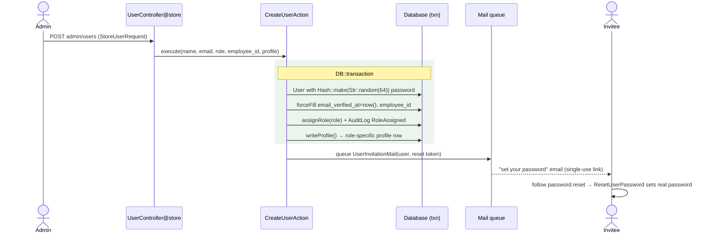
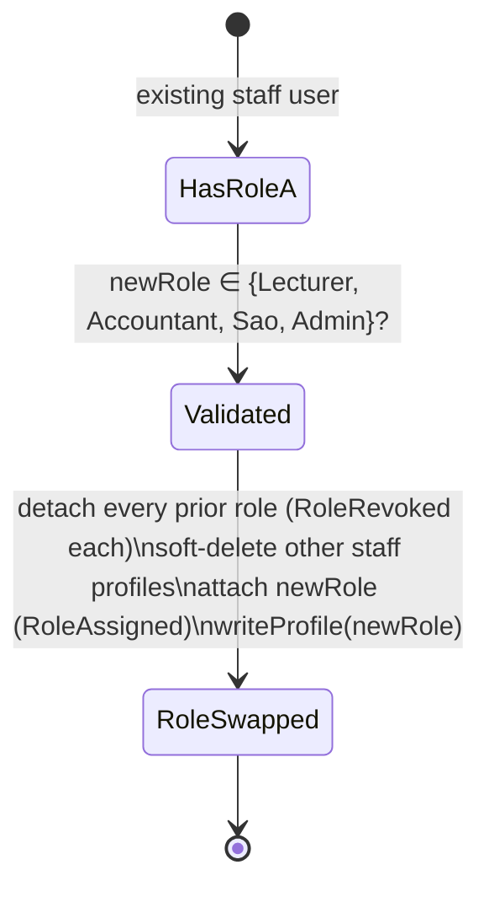
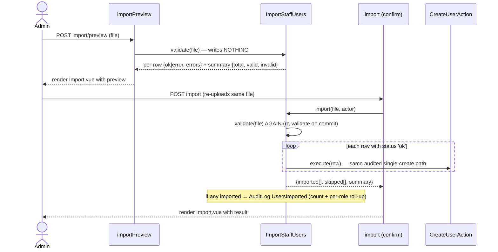

# Admin user management

How an administrator provisions and manages the **staff and admin** accounts that run SchuLyf —
lecturers, accountants, Student Affairs Officers (SAO), and other admins. The admin **never sets a
password**: every account is provisioned with a throwaway secret and the invitee sets their own
password through a single-use, emailed setup link. Staff can be created one at a time or in bulk
from a CSV, and an admin can later move a user between staff roles. This is the module that
implements GitHub #30 (bulk import) on top of the original single-create admin module.

> Cross-references: [architecture.md](../architecture.md) (request lifecycle, the action layer),
> [data-model.md](../data-model.md) (users, roles, profile tables), [routes.md](../routes.md)
> (the admin route group + endpoint inventory), [security.md](../security.md) (the invite-link
> credential flow §1.5, authorization §2, the immutable audit log §3), and
> [testing.md](../testing.md).

---

## 1. Purpose

The university needs staff accounts (lecturers, accountants, SAO, admins) created and curated by an
administrator rather than self-registered. Two real problems shape the design:

- **Credentials must never travel through an admin.** An admin who types a colleague's password is a
  liability. Instead the admin creates the account and the system mails the new user a single-use
  link to set their own password — the link itself proves the person controls the mailbox.
- **Onboarding a cohort of staff one-by-one is slow.** A two-step CSV import (preview → confirm)
  lets an admin validate a whole spreadsheet before committing, with every valid row created through
  the exact same audited path as a single create.

Applicants and Students are **not** created here — applicants self-register, and students are
produced by the SAO admission flow. This module's writable roles are **staff + admin only**.

---

## 2. Roles & abilities

| Who | What they may do | Gate / guard |
|---|---|---|
| **Admin** | Everything in this module — list, create, edit, deactivate/restore, resend invite, change role, bulk import, read the audit log | `role:admin` middleware on the whole `routes/admin.php` group; the audit-log read is additionally protected by the `view-audit-log` **ability gate** |
| Any other role | Nothing — every endpoint returns `403` | blocked by `role:admin` |

There is **no policy class** for users — authorization is the route-group `role:admin` middleware
(`EnsureUserHasRole`), plus the `view-audit-log` gate from `AppServiceProvider::ABILITIES` on the
audit-log endpoint. Two self-targeting actions are blocked **in the controller**, not by a gate:

- an admin **cannot deactivate their own account** (`UserController@destroy`), and
- an admin **cannot change their own role** (`UserController@changeRole`).

See [security.md §2](../security.md) for the gate/middleware machinery.

### Creatable roles

`StoreUserRequest::CREATABLE_ROLES` is the single source of truth for what an admin may provision:

```
[ RoleName::Lecturer, RoleName::Accountant, RoleName::Sao, RoleName::Admin ]
```

`Applicant` and `Student` are deliberately **excluded** — submitting either value fails the `role`
validation rule (`Rule::in` over the creatable values). The same constant feeds the bulk-import
row rules, the role-change rule, and the admin role dropdown, so the four paths cannot drift.

---

## 3. Data model

This module reads and writes the user identity + role + one role-specific profile. Column detail
lives in [data-model.md](../data-model.md); here is only what a contributor must hold in their head.

| Model | Role in this module | Key relations |
|---|---|---|
| `User` | The account. `implements MustVerifyEmail`, `use HasRoles`, `use RecordsAudit`. | `roles()` (belongs-to-many `Role` via `role_user`); `lecturerProfile()` / `accountantProfile()` / `saoProfile()` (each `HasOne`) |
| `Role` | The role row (`name` is a `RoleName` enum). Seeded; never created here. | inverse of `User::roles()` |
| `LecturerProfile` | Lecturer's `department_id`, `specialization`, `hired_at`. Soft-deletes. | `belongsTo(User)`, `belongsTo(Department)` |
| `AccountantProfile` | Accountant's `bank_desk`, `cashier_window`. Soft-deletes. | `belongsTo(User)` |
| `SaoProfile` | SAO's `scope`. Soft-deletes. | `belongsTo(User)` |
| `AuditLog` | Append-only trail; written for every significant write here. | `belongsTo(User)` (actor) + polymorphic `subject` |

Notable column facts:

- **`users.employee_id`** is deliberately **outside `$fillable`** (`AUD-007`). The admin module is
  its only writer — `CreateUserAction` and `UserController@update` set it via `forceFill`. It is
  stored lowercased and is one of the four login identifiers (see [security.md §1.1](../security.md)).
- **`users.email_verified_at`** is stamped `now()` at creation: the invite link is itself proof of
  mailbox control, so staff are pre-verified by design.
- Each profile table has a **unique `user_id`** and **soft-deletes**, which is why role changes
  soft-delete the old profile and restore-in-place rather than insert a colliding row.
- Roles are a many-to-many table, but provisioning enforces **exactly one** staff role per user
  (see the drift note in §5).

---

## 4. Routes & screens

All routes are in the `admin/` + `role:admin` group of `routes/admin.php` (name prefix `admin.`).
Inertia pages live under `resources/js/pages/admin/users/`.

| Method · URI | Name | Controller action | Screen |
|---|---|---|---|
| GET · `admin/users` | `admin.users.index` | `index` | `admin/users/Index.vue` — paginated list, role/status/search filters |
| GET · `admin/users/create` | `admin.users.create` | `create` | `admin/users/Create.vue` — create form |
| POST · `admin/users` | `admin.users.store` | `store` | (redirect to index) |
| GET · `admin/users/import` | `admin.users.import` | `importForm` | `admin/users/Import.vue` — upload + preview/result |
| GET · `admin/users/import/template` | `admin.users.import.template` | `importTemplate` | CSV download (no page) |
| POST · `admin/users/import/preview` | `admin.users.import.preview` | `importPreview` | `admin/users/Import.vue` (`preview` prop) |
| POST · `admin/users/import` | `admin.users.import.store` | `import` | `admin/users/Import.vue` (`result` prop) |
| GET · `admin/users/{user}/edit` | `admin.users.edit` | `edit` | `admin/users/Edit.vue` — name/profile + role-change |
| PATCH · `admin/users/{user}` | `admin.users.update` | `update` | (redirect to edit) |
| DELETE · `admin/users/{user}` | `admin.users.destroy` | `destroy` | (redirect to index) — soft-delete |
| POST · `admin/users/{user}/restore` | `admin.users.restore` | `restore` | (redirect to index) — `withTrashed` |
| POST · `admin/users/{user}/resend-invite` | `admin.users.resend-invite` | `resendInvite` | (redirect back) |
| PATCH · `admin/users/{user}/role` | `admin.users.role` | `changeRole` | (redirect to edit) |
| GET · `admin/audit-logs` | `admin.audit-logs.index` | `AuditLogController@index` | JSON for the audit-log modal; `throttle:audit-logs`, `view-audit-log` gate |

> **Route ordering note:** the literal `users/import*` segments are declared **before**
> `users/{user}/...` so the wildcard never captures `import`. Preserve that order when editing
> `routes/admin.php`.

The setup link the invitee follows is **not** in this group — it is Fortify's public
`password.reset` route (`GET password/reset/{token}`). `UserInvitationMail` builds that URL.

---

## 5. Flows

### 5.1 Create a single staff/admin user (invite-link credential flow)

`UserController@store` validates with `StoreUserRequest`, then delegates to
`App\Actions\Admin\CreateUserAction::execute()`.



**Guarded invariants in `CreateUserAction`:**

- The user is saved with a **random 64-char password the admin never sees**. The only first-login
  path is the emailed setup link. The plaintext is **never logged, audited, or stored** —
  `RecordsAudit` writes one `Created` row with `password` masked `[redacted]` (`auditRedact()`).
- The whole provision (user + role + profile) runs in **one `DB::transaction`**, so a failing
  profile insert (e.g. a non-existent `department_id`) rolls the user back — no half-created account
  and **no invite is queued** (the `Mail::queue` is outside the transaction and only runs on commit).
- `employee_id` is written via `forceFill` (it is outside `$fillable`).
- `email` uniqueness **includes soft-deleted rows** (`Rule::unique` queries the raw table). A trashed
  match is rejected with a "restore them instead" hint rather than duplicating the account.

**Setting the password (the invite link's far end).** The setup link is a Fortify password-reset
link. When the invitee submits it, `App\Actions\Fortify\ResetUserPassword::reset()` validates the new
password and `forceFill`s it onto the (non-trashed) user. The same action doubles as soft-deleted
account reactivation for **non-staff** accounts — irrelevant to a freshly-invited staff user, but see
[security.md §1.6](../security.md). `CreateNewUser` (public registration) is **not** part of this
module; it is the applicant funnel and explicitly cannot claim an existing/trashed email.

**Resend invite.** `UserController@resendInvite` calls `CreateUserAction::sendInvitation()`, which
calls `Password::broker()->createToken($user)`. Fortify's broker stores **one** active token per
user, so creating a fresh token **invalidates the previous one** — the old link stops working the
moment a new invite is sent. (Verified by `ManageUsersTest`: "regenerates and resends the invitation,
invalidating the prior token".)

### 5.2 Change a user's role

`UserController@changeRole` (guarded against self-change) → `ChangeUserRoleAction::execute()`.



**Guarded invariants in `ChangeUserRoleAction`:**

- The target role must be one of `{Lecturer, Accountant, Sao, Admin}`, else it throws a
  `RuntimeException` (a second guard behind the request's `Rule::in`).
- Every **prior** role is detached, each writing a `RoleRevoked` audit row; the new role is attached
  writing a `RoleAssigned` row. If the user already holds the target role, no spurious re-assign or
  audit row is written.
- `softDeleteOtherStaffProfiles()` soft-deletes the profile rows that don't match the new role,
  keeping each profile's unique `user_id` clean.
- `writeProfile()` (from `WritesRoleProfile`) **restores a previously soft-deleted profile in place**
  rather than colliding on the unique `user_id`; a same-role rewrite leaves the existing row
  untouched (no `Deleted`/`Restored`/`RoleRevoked`/`RoleAssigned` churn — verified by
  `ManageUsersTest`).

### 5.3 Bulk CSV import (two-step preview → confirm)

`App\Actions\Admin\ImportStaffUsers` parses and validates a CSV. The flow is **stateless across the
two requests** — nothing is stored between preview and confirm; the browser re-uploads the file.



**Guarded invariants / facts in `ImportStaffUsers`:**

- **Preview writes nothing.** `validate()` only parses, validates, and returns a per-row preview +
  summary; no user is created and no mail is queued (verified by `ImportStaffUsersTest`).
- **Confirm re-validates.** `import()` calls `validate()` again on the freshly re-uploaded file —
  there is no trust in the preview — then runs **every still-valid row** through
  `CreateUserAction::execute()`. So bulk-created users are byte-for-byte the same as single-created
  ones: same role+profile transaction, same queued invite, same audit rows. Invalid rows are
  collected into `skipped` and never created.
- **Row cap `MAX_ROWS = 500`.** Exceeding it is a **fatal** error for the whole file (split and
  retry), keeping the per-row create loop bounded.
- **Native CSV parsing — no dependency.** Parsing uses `SplFileObject` with the CSV read flags (and
  the template is written with `fputcsv`); there is no third-party CSV/spreadsheet package.
- **Required headers** are `name, email, role`; a missing one is fatal. Full column order is
  `ImportStaffUsers::COLUMNS` and is downloadable via the template route.
- **Per-row rules mirror `StoreUserRequest`** (creatable-role `Rule::in`, the
  `EMPLOYEE_ID_REGEX`, email unique **including trashed**), plus extras the single form can't express:
  **in-file** duplicate-email / duplicate-employee_id detection (flags the *second* occurrence) and
  **department-code resolution** for lecturer rows (`department_code` is required for lecturers and
  must resolve against the `departments` table).
- The upload itself is bounded by `ImportStaffUsersRequest`: `file`, `mimes:csv,txt`, `max:512` KB.

### 5.4 Deactivate / restore

`destroy` soft-deletes (`$user->delete()`) — blocked for self. `restore` looks the row up with
`onlyTrashed()` and restores it. Role + profile survive a soft-delete/restore round-trip
(`ManageUsersTest`). Restoring a staff member here is the **only** path back for trashed staff —
self-service reactivation excludes staff/admin (see [security.md §1.6](../security.md)).

### 5.5 Edit (name / profile / employee_id)

`update` mirrors create's `employee_id` discipline (`forceFill`, lowercased, unique-ignoring-self).
It updates the role-specific profile in place for whatever single staff role the user currently
holds; it does **not** change the role (that is `changeRole`).

---

## 6. Side effects (mail + audit)

### Mail

| Mailable | When | Notes |
|---|---|---|
| `UserInvitationMail` | After a successful create (and on resend-invite, and once per imported row) | `ShouldQueue` (queued, not sent inline); markdown view `mail.user-invitation`; subject "Welcome to {app} — set your password"; carries a Fortify reset token in the `password.reset` URL; link expiry rendered from `config('auth.passwords.users.expire')` = **72 hours** (4320 min) |

The Mailable is the **only** notification this module emits. There are no events/listeners specific
to user management beyond the audit listeners described below.

### Audit (`App\Enums\AuditAction`)

Every significant write lands in the append-only `audit_logs` table. Two sources:

| Trigger | Action(s) recorded | Written by |
|---|---|---|
| Create user (single or per import row) | `Created` (User, `password` redacted), `RoleAssigned`, `Created` (profile) | `RecordsAudit` model hooks + explicit `AuditLog::record` in `CreateUserAction` |
| Change role | `RoleRevoked` (one per detached role), `RoleAssigned` | `ChangeUserRoleAction` |
| Edit user | `Updated` (User, secrets redacted; timestamp-only changes write nothing), profile `Updated` | `RecordsAudit` hooks |
| Deactivate / restore | `Deleted` / `Restored` (User) | `RecordsAudit` hooks |
| Bulk import (confirm) | `UsersImported` — context `{count, roles: {<role>: n}}`, actor = the admin | explicit `AuditLog::record` in `ImportStaffUsers::import()` (only when ≥1 row imported) |

The **random plaintext password is never present** in any audit row — proven by
`CreateUserTest` ("never persists or audits the random plaintext password"). See
[security.md §3](../security.md) for the audit log's immutability, retention, and redaction rules.

### Reading the audit log

Admins read the trail through a modal backed by `AuditLogController@index` (`admin/audit-logs`,
`view-audit-log` gate, `throttle:audit-logs`). It returns paginated JSON validated by
`AuditLogIndexRequest`, with filters for actor (`user_id`), actor-or-affected-account
(`involving_user_id`), `actions[]`, `subject_types[]` (short class names → FQCNs), and a `from`/`to`
date range. `subject_types` are restricted to a `SUBJECT_TYPES` allowlist (`422` otherwise).

---

## 7. Tests

Pest feature tests live under `tests/Feature/Admin/`:

| File | Critical paths covered |
|---|---|
| `CreateUserTest.php` | Create per role (txn: user+role+profile+invite); non-admin `403`; **Applicant/Student rejected**; trashed-email rejected with restore hint; profile-failure rollback (no user, no mail); invite carries a **valid** reset token; the three audit rows; mail renders the human role label; **plaintext password never persisted or audited** |
| `ManageUsersTest.php` | Index list + role/status/search filters; soft-delete then restore keeps role+profile; **self-deactivation forbidden**; **resend rotates the token** (prior token invalidated); change-role revokes old + attaches new (with audit); **self-role-change forbidden**; edit name+profile without role change; same-role rewrite has no audit churn; re-attach reuses the soft-deleted profile row |
| `ImportStaffUsersTest.php` | Preview writes nothing & queues no mail; the per-row validation matrix (bad email, missing name, unknown/non-creatable role, bad/missing department code, bad employee_id, in-file duplicate email & employee_id, trashed-email collision); confirm imports valid + skips invalid + queues one invite each + lowercases employee_id + audits `UsersImported`; fatal missing-header error; template download; **non-admin `403` on every import endpoint** |
| `EmployeeIdTest.php` | employee_id trimmed+lowercased and usable as a login identifier; duplicate `422`; shadowing values (`@`, `stm-`) rejected; update sets/clears employee_id; same-value re-save stays valid |
| `AuditLogIndexTest.php` | Newest-first pagination; filters by `user_id` / `involving_user_id` / `actions[]` / `subject_types[]` / date range; `rows` paging; every `AuditAction` exposed in options; unknown subject-type and inverted date range both `422` |
| `AdminAuthorizationTest.php` | The `role:admin` group denies non-admins |

See [testing.md](../testing.md) for the suite-wide conventions (`userWithRole()`, `withoutVite()`,
`Mail::fake()`).

---

## 8. File map

| File | Role |
|---|---|
| `routes/admin.php` | The `admin/` + `role:admin` route group; `admin.users.*` + `admin.audit-logs.index` |
| `app/Http/Controllers/Admin/UserController.php` | CRUD + import + resend-invite + change-role; self-target guards; list filters; Inertia props |
| `app/Http/Controllers/Admin/AuditLogController.php` | JSON for the audit-log modal |
| `app/Actions/Admin/CreateUserAction.php` | The single-create transaction + queued invite; the **one** create path (also used by import) |
| `app/Actions/Admin/ChangeUserRoleAction.php` | Role transition: revoke old roles+profiles, attach new, audit both sides |
| `app/Actions/Admin/ImportStaffUsers.php` | CSV parse/validate (preview) + re-validate-and-create (confirm); `MAX_ROWS=500`, `COLUMNS`, native `SplFileObject` |
| `app/Actions/Admin/Concerns/WritesRoleProfile.php` | Shared profile writer (restore-in-place) + `softDeleteOtherStaffProfiles()` |
| `app/Actions/Fortify/ResetUserPassword.php` | The far end of the invite link — sets the real password (and non-staff reactivation) |
| `app/Mail/UserInvitationMail.php` | Queued "set your password" mail; builds the `password.reset` setup URL |
| `app/Http/Requests/Admin/Users/StoreUserRequest.php` | Create validation; `CREATABLE_ROLES`, `EMPLOYEE_ID_REGEX`, email-unique-including-trashed; `role()`/`employeeId()`/`profilePayload()` |
| `app/Http/Requests/Admin/Users/UpdateUserRequest.php` | Edit validation (employee_id unique-ignoring-self); `profilePayloadFor()` |
| `app/Http/Requests/Admin/Users/ChangeRoleRequest.php` | Role-change validation; `role()`/`profilePayload()` |
| `app/Http/Requests/Admin/Users/ImportStaffUsersRequest.php` | Upload validation (`mimes:csv,txt`, `max:512`) |
| `app/Http/Requests/Admin/AuditLogIndexRequest.php` | Audit-log filter validation + `SUBJECT_TYPES` allowlist |
| `app/Enums/RoleName.php` | Role enum; `label()`, `staff()` |
| `app/Enums/AuditAction.php` | Audit action enum (`RoleAssigned`, `RoleRevoked`, `UsersImported`, lifecycle cases) |
| `app/Models/Concerns/HasRoles.php` | `roles()`, `assignRole()`, `removeRole()`, `hasRole()`/`hasAnyRole()` |
| `app/Models/User.php` | The account; `MustVerifyEmail`, `HasRoles`, `RecordsAudit`, profile relations |
| `app/Models/{LecturerProfile,AccountantProfile,SaoProfile}.php` | Role-specific profile rows (soft-deletes, unique `user_id`) |
| `resources/js/pages/admin/users/{Index,Create,Edit,Import}.vue` | The four admin screens |

---

## 9. Drift note — single-role staff (planned multi-role pivot)

`plan/context.md` §4.3 originally envisaged **multi-role** staff via a `role_user` pivot. As built,
staff/admin accounts are **single-role**:

- `CreateUserAction` assigns exactly one role and writes exactly one profile.
- `ChangeUserRoleAction` **detaches every existing role** before attaching the new one and
  soft-deletes the non-matching profiles — a swap, not an accumulation.
- The role-switcher UI (GitHub #20 / backlog B7) was **closed as not-planned**.

The underlying schema (`role_user` many-to-many) and the gate/middleware machinery
(`hasAnyRole`) remain multi-role-*capable*; only the provisioning path is single-role today. The
Applicant + Student account union still exists outside this module (applicants self-register,
students come from SAO admission). This decision should be recorded in an ADR (single-role staff
provisioning, superseding the multi-role intent) — that ADR is authored separately, not here. See
also [security.md §2.3](../security.md), which carries the same drift note.
