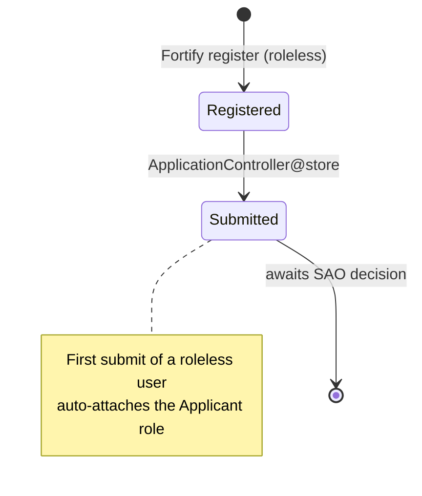
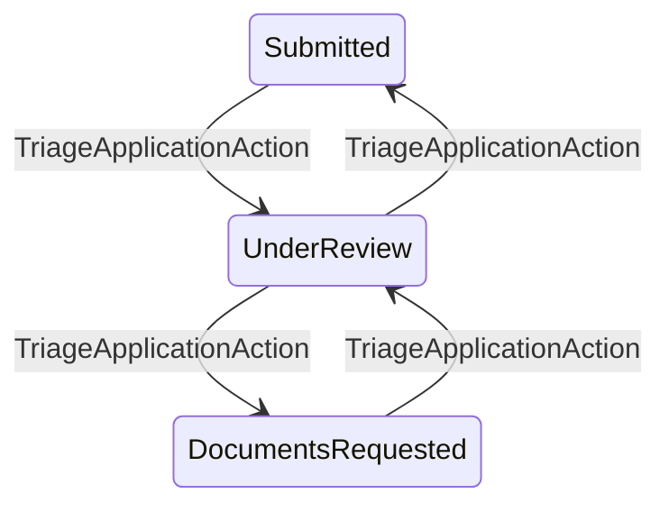
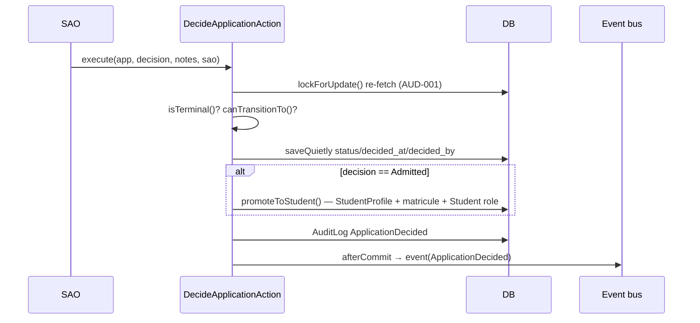
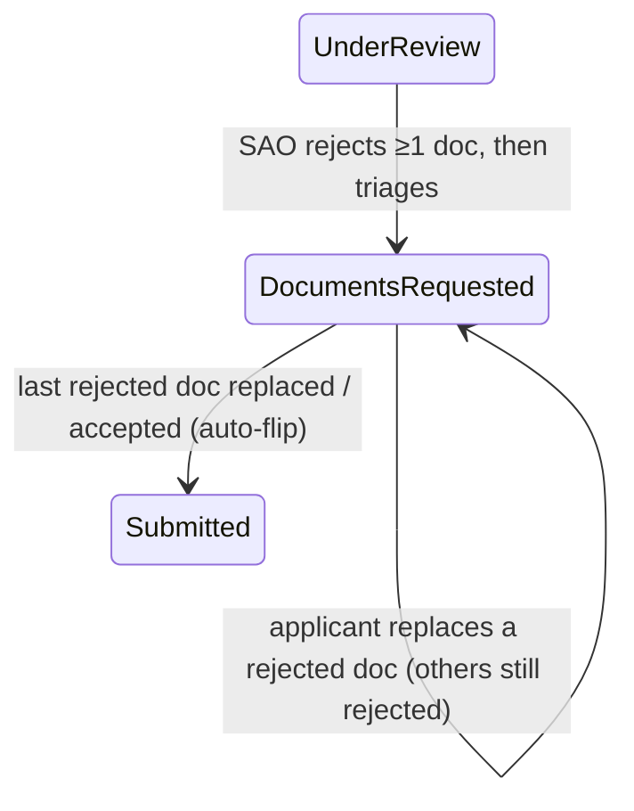

# Admissions

The applicant funnel and the Student Affairs Office (SAO) decision workflow: a prospective student
registers, fills a multi-step application against cascading programme/level dropdowns, uploads the
required documents, and submits. An SAO then triages the application through interim states and
records a terminal decision. On **Admit**, the applicant atomically becomes a student — a
`StudentProfile` is created with a year-scoped matricule and the **Student** role is assigned. This
replaces the paper-folder admission process described in the project's domain narrative.

> Cross-references: [architecture.md](../architecture.md) (request lifecycle, the Action-class
> pattern), [data-model.md](../data-model.md) (full column detail for every table named here),
> [routes.md](../routes.md) (the complete endpoint inventory + route split), and
> [security.md](../security.md) (auth, gates, the audit log, file-viewer hardening, and the
> verify-first reactivation posture this module reuses).

---

## 1. Purpose

In the university this system models, admission was a manual, in-person process: a candidate filled a
physical form, attached supporting documents, dropped the folder at the student-affairs office, and
waited to be notified of a decision by mail. Once admitted, the candidate became a student with a
matricule and campus access.

This module digitises that funnel end to end:

- **Applicant side** — registration, a guided application form whose document slots are driven by the
  chosen programme + level, file uploads, and a one-open-application-at-a-time rule.
- **SAO side** — a triage queue, a per-application review screen showing the candidate's prior
  enrollment history, reversible interim transitions, and a single terminal decision that — on Admit
  — provisions the student record and flips the user's role in one transaction.
- **Returning-student paths** — a soft-deleted account reactivates verify-first (via password reset,
  never by re-registering), and an SAO can merge a new application into a returning applicant's prior
  enrollment instead of issuing a fresh matricule.

---

## 2. Roles & abilities

| Role | What they do here | Guard |
|---|---|---|
| Guest / roleless user | Register; land on the applicant dashboard; start + submit an application | `auth` + `verified` middleware (no role gate — see below) |
| Applicant | View own applications and a single application's detail; submit; replace a rejected document when documents are requested | Ownership check in `ApplicationController::show` / `@replaceDocument` (`403` if not the owner); `auth` + `verified` |
| SAO | Triage, decide, restore prior enrollment; browse the queue | `role:sao,admin` middleware on the whole `routes/sao.php` group |
| Admin | Everything an SAO can do | Same `role:sao,admin` group (Admin is included) |

**Gate vs. middleware (verified nuance).** `AppServiceProvider::ABILITIES` defines two admissions
gates — `process-admission` and `decide-application` (both → SAO, Admin) — and they are exhaustively
tested in `tests/Feature/Auth/AbilityGatesTest.php`. **In the shipped admissions code these gates are
not invoked anywhere**: the SAO controller and its Form Requests carry no `Gate::authorize()` /
`$this->authorize()` calls. Authorization is enforced entirely by the `role:sao,admin` route
middleware. The gates exist as a tested, ready-to-use abstraction but are currently belt to the
middleware's braces. See [security.md](../security.md) §2 for the gate/middleware layering.

> The applicant routes deliberately have **no** role guard. A freshly-registered (or just-reactivated)
> user is roleless; `applicant/dashboard` and the application form are the roleless fallback they land
> on before applying. The **Applicant** role is auto-attached on the first successful submit, not at
> registration (see §5.1).

---

## 3. Data model

The module owns these tables. See [data-model.md](../data-model.md) for full columns, indexes, and
the ER diagram; only the contributor-relevant shape is shown here.

| Model | Role | Key relations |
|---|---|---|
| `Application` | One admission request | `belongsTo` User (`user_id`, as `applicant`); `belongsTo` ProgramOffering (`withTrashed`); `belongsTo` User (`decided_by_user_id`, as `decidedBy`); `hasMany` ApplicationDocument. `SoftDeletes`, `RecordsAudit`. |
| `ApplicationDocument` | One uploaded file on an application | `belongsTo` Application; `belongsTo` DocumentType; `belongsTo` User (`reviewed_by`, as `reviewedBy`). Stores `file_path`, `original_filename`, `mime_type`, `size_bytes`, `uploaded_at`, plus the per-document review state `status` (`ApplicationDocumentStatus`, default `pending`), `review_notes`, `reviewed_at`. `SoftDeletes`, `RecordsAudit`. |
| `Department` | Academic department | `hasMany` ProgramOffering. |
| `ProgramOffering` | A (department × degree programme) offering with a `min_level`/`max_level` range | `belongsTo` Department; `hasMany` LevelCredentialRequirement; `hasMany` Application. `SoftDeletes`. |
| `LevelCredentialRequirement` | "For this offering at this level, document X is required" | `belongsTo` ProgramOffering; `belongsTo` DocumentType. |
| `DocumentType` | A catalogue document kind (NID, BIRTH, …) | `hasMany` LevelCredentialRequirement. `PROTECTED_CODES = ['NID','BIRTH']` are always-required and undeletable (`AUD-014`). |
| `StudentProfile` | The student record minted on Admit | `belongsTo` User; `belongsTo` ProgramOffering (`withTrashed`). Holds the `matricule`, `level`, `academic_year`, `enrolled_at`, `status` (`StudentStatus`). `SoftDeletes`, `RecordsAudit`. |
| `matricule_sequences` (table, not a model) | One row per year holding `last_number` | Counter read under `lockForUpdate()` to issue `stm-YYYY-NNNN`. |

**Status enums.**

- `ApplicationStatus` (string-backed, lowercase `->value`): `Submitted`
  (`submitted`), `UnderReview` (`under_review`), `DocumentsRequested` (`documents_requested`),
  `Admitted` (`admitted`), `Rejected` (`rejected`), `Waitlisted` (`waitlisted`), `Withdrawn`
  (`withdrawn`). Applications are **born `Submitted`** — there is no `Draft` state (removed in
  ADR-0024). The Vue pages render `status.value`, so any UI status map must key on the lowercase
  string.
- `Application` defines three sets that drive every guard:
  - `INTERIM_STATUSES` = Submitted, UnderReview, DocumentsRequested (reversible, SAO triage)
  - `TERMINAL_STATUSES` = Admitted, Rejected, Waitlisted, Withdrawn (no further transition)
  - `OPEN_STATUSES` = the interim trio (the "one open application" rule) — equal to
    `INTERIM_STATUSES` now that `Draft` is gone, kept as a semantic alias
- `StudentStatus`: `Active`, `Suspended`, `Graduated`, `Withdrawn`. A new profile is `Active`.
- `RoleName`: the Admit path assigns `Student`; first submit auto-attaches `Applicant`.
- `ApplicationDocumentStatus` (string-backed): `Pending` (`pending`), `Accepted` (`accepted`),
  `Rejected` (`rejected`). Every uploaded document starts `pending`; an SAO accepts or rejects each
  one individually, and requesting documents from an applicant requires at least one `rejected`
  document (see §5.2).

> **Matricule format.** `stm-{year}-{0000}`, year-scoped (e.g. `stm-2026-0001`). It is lowercased on
> write (the `matricule()` attribute mutator) to match the case the Fortify login resolver
> canonicalises identifiers to — a student can log in with their matricule (see
> [security.md](../security.md) §1.1).

---

## 4. Routes & screens

### 4.1 Applicant (`routes/web.php`, inside the `['auth','verified']` group)

| Method · URI | Name | Controller | Inertia page |
|---|---|---|---|
| GET `applicant/dashboard` | `applicant.dashboard` | `Applications\ApplicationController@dashboard` | `dashboards/Applicant` |
| GET `application/new` | `application.create` | `…@create` | `applicant/applications/Create` |
| POST `application` | `application.store` | `…@store` | — (redirects to dashboard) |
| GET `application/{application}` | `application.show` | `…@show` | `applicant/applications/Show` |
| GET `applications/{application}/documents/{document}/download` | `application.documents.download` | `Applications\DocumentDownloadController` | — (file stream) |
| GET `applications/{application}/documents/{document}/view` | `application.documents.view` | `Applications\DocumentViewController` | — (inline file stream) |
| POST `applications/{application}/documents/{document}` | `application.documents.replace` | `…@replaceDocument` | — (back; replace a rejected document) |

### 4.2 Cascading-dropdown JSON lookups (`routes/web.php`, `api/v1` prefix, `throttle:lookups`)

These are **session-authenticated, same-origin `fetch()` targets**, not a token API (per
`CLAUDE.md` "Database & Routes"). They return plain JSON arrays, not Inertia responses.

| Method · URI | Name | Controller method | Returns |
|---|---|---|---|
| GET `api/v1/program-offerings` | `api.v1.program-offerings.index` | `ApplicationController@offerings` | Offerings, optionally filtered by `degree_program` and/or `department_id` |
| GET `api/v1/level-requirements` | `api.v1.level-requirements.index` | `ApplicationController@levelRequirements` | Required document types for a given `(offering, level)` pair |

Both read from `App\Services\ReferenceDataCache` (`departments()`, `offerings()`,
`levelRequirements()`, `protectedDocumentTypes()`) rather than hitting the DB per request. The
`Create` page is seeded with `departments`, `degreePrograms`, and `alwaysRequiredDocumentTypes` on
first render; offerings and per-level requirements are fetched on demand as the dropdowns cascade.

### 4.3 SAO (`routes/sao.php`, `['auth','verified','role:sao,admin']`, `sao.` name prefix)

| Method · URI | Name | Controller method | Inertia page |
|---|---|---|---|
| GET `sao/dashboard` | `sao.dashboard` | `ApplicationReviewController@dashboard` | `dashboards/Sao` (per-status counts) |
| GET `sao/applications` | `sao.applications.index` | `@index` | `sao/applications/Index` (filterable, paginated queue) |
| GET `sao/applications/{application}` | `sao.applications.show` | `@show` | `sao/applications/Review` (detail + prior history) |
| POST `sao/applications/{application}/triage` | `sao.applications.triage` | `@triage` | — (back) |
| POST `sao/applications/{application}/decide` | `sao.applications.decide` | `@decide` | — (redirect to index) |
| POST `sao/applications/{application}/restore-prior` | `sao.applications.restorePrior` | `@restorePrior` | — (redirect to index) |
| POST `sao/applications/{application}/documents/{document}/accept` | `sao.applications.documents.accept` | `@acceptDocument` | — (back; accept one document) |
| POST `sao/applications/{application}/documents/{document}/reject` | `sao.applications.documents.reject` | `@rejectDocument` | — (back; reject one document with a reason) |

The queue defaults to the actionable interim trio but accepts any `ApplicationStatus` so SAOs can
also browse decided rows; `sort_field` is whitelisted (`submitted_at`, `created_at`, `level`).

---

## 5. Flows

### 5.1 Applicant: register → apply → submit

1. **Register** — public `/register` (Fortify). `CreateNewUser` creates a roleless,
   email-unverified user. Registering with an **active or soft-deleted** email both fail the unique
   email rule with the same `422` — the two are indistinguishable, so a deactivated account can never
   be claimed anonymously (`AUD-004`). Returning users reactivate through password reset instead
   (§5.4).
2. **Build the form** — `@create` renders `applicant/applications/Create` with reference data; the
   `api/v1` lookups drive the cascading degree-programme → department → offering → level → required
   documents chain. The always-required NID + BIRTH slots are seeded from
   `DocumentType::PROTECTED_CODES`.
3. **Submit** — `StoreApplicationRequest` validates the payload. `requiredDocumentCodes()` computes
   the mandatory upload set as `PROTECTED_CODES` ∪ any `LevelCredentialRequirement` rows flagged
   `required` for the chosen `(offering, level)`. `LevelWithinOfferingRange` enforces the offering's
   level band. An `after()` hook refuses a second submission while an `OPEN_STATUSES` application
   already exists.
4. **Persist (`ApplicationController@store`)** — the **rejected/happy split** is the key to the
   guards:
   - **Files first, outside the transaction** — uploads are written to the `applications` disk path
     *before* the transaction opens so multi-MB I/O never holds the connection or the per-user lock.
     Any throwable after that point deletes the stored files in the `catch` (`AUD-009`).
   - **Per-user mutex** — inside `DB::transaction`, the user row is `lockForUpdate()`-ed and
     `userHasOpenApplication()` is re-checked, closing the concurrent-submit race the Form Request's
     check alone can't (`AUD-005`). On a race loss → `ValidationException` on `program_offering_id`.
   - On success: the `Application` is created `status = Submitted`, `submitted_at = now()`; one
     `ApplicationDocument` row per stored file; and if the user is roleless
     (`roles()->doesntExist()`), the **Applicant** role is assigned with a `RoleAssigned` audit row.

### 5.2 SAO triage (interim ↔ interim)

`POST …/triage` → `TriageApplicationAction::execute()`. It re-fetches the application under
`lockForUpdate()` (stale-status defence, `AUD-001`), then calls `$application->canTransitionTo($next)`
— which permits an **interim source → any status** and refuses every terminal source. The target
itself is constrained to `INTERIM_STATUSES` by `TriageApplicationRequest`; `notes` are **optional** on
every target. Choosing `DocumentsRequested` is only allowed when **at least one document is already
`rejected`** — the guard throws a `ValidationException` on `status` ("Reject at least one document
before requesting documents.") otherwise, so a documents request always names concrete documents to
replace (see §5.6). Writes via `saveQuietly()` and records one **`StatusChanged`** audit row
(`before`/`after`). On **entry into `DocumentsRequested`** the action dispatches
`ApplicationDocumentsRequested($application)` via `DB::afterCommit()`, which drives the queued
"documents requested" email (§6.1); the other interim moves fire no event.

### 5.3 SAO decision (interim → terminal); Admit mints the student

`POST …/decide` → `DecideApplicationRequest` (allows only Admitted / Rejected / Waitlisted —
**`Withdrawn` is not selectable here**; `notes` required for Rejected and Waitlisted) →
`DecideApplicationAction::execute()`:

1. Guards `$decision` against `ALLOWED_DECISIONS` (the same three).
2. In `DB::transaction`, re-fetches under `lockForUpdate()`; refuses if `isTerminal()` (re-decide a
   finalized row) or if `! canTransitionTo($decision)` (e.g. decide a Draft).
3. `saveQuietly()`s `status`, `decision_notes`, `decided_at`, `decided_by_user_id`.
4. **On Admit → `promoteToStudent()`** (the role flip + matricule):
   - Looks up the applicant's `StudentProfile::withTrashed()` under `lockForUpdate()` —
     `student_profiles.user_id` is UNIQUE *including trashed rows* (`AUD-003`), so a returning
     applicant must reuse their slot.
   - **No profile** → create one with `nextMatriculeForYear($year)`.
   - **Trashed profile** → `restore()` and issue a **fresh** matricule (admit-as-new-student).
   - **Active profile** → keep the existing matricule (a student's login identifier never changes
     silently); only the enrollment (`level`, `academic_year`, `enrolled_at`, `status`) moves.
   - If the applicant doesn't already hold **Student**, `assignRole(Student)` + a `RoleAssigned`
     audit row.
   - Matricules come from `StudentProfile::nextMatriculeForYear()`: a one-row-per-year
     `matricule_sequences` counter read under `lockForUpdate()`, seeded from the highest already-issued
     number (including trashed/force-deleted rows) so numbers are never reused (`AUD-006`).
5. Records one **`ApplicationDecided`** audit row (`{decision, notes}` + any
   `acknowledged_prior_history` context).
6. `DB::afterCommit()` dispatches `ApplicationDecided($application->fresh(), $sao)` — strictly after
   the transaction commits, so the queued mailer never reads an uncommitted row.

### 5.4 Returning-student reactivation (verify-first)

A soft-deleted **non-staff** account does not re-register; it reactivates by proving mailbox control
through the password-reset flow (see [security.md](../security.md) §1.6):

- A custom `eloquent-with-trashed` password-broker provider lets a *trashed* non-staff user receive a
  reset link. Trashed **staff/admin** accounts (`RoleName::staff()`) are filtered out — only an admin
  can restore them.
- `ResetUserPassword::reset()` detects `$user->trashed()` and routes to `reactivate()`:
  `restoreQuietly()`, set the new password, **detach every role** (the user re-enters roleless), and
  record one **`RoleRevoked`** row per detached role plus one **`Restored`** row, all stamped with
  `context: ['reactivated' => true]` (`AUD-028`).
- The reactivated, roleless user lands back on the applicant dashboard and re-applies normally; the
  SAO re-attaches prior enrollment during review (§5.5).

### 5.5 SAO merge into prior enrollment

When the review screen surfaces a returning applicant with a soft-deleted prior `StudentProfile`, the
SAO can merge rather than mint a new record. `POST …/restore-prior` → `RestorePriorEnrollment`:

- Validates the prior profile and current application both belong to the same applicant; both rows are
  re-fetched under `lockForUpdate()`.
- Refuses if the prior profile is **not** trashed, if the current application `isTerminal()`, or if it
  can't transition to `Withdrawn`.
- `restore()`s the prior profile (keeping its **original** matricule — that is the whole point versus
  the Admit path's fresh number), `assignRole(Student)`, and sets the current application to
  **`Withdrawn`** with a "Merged into prior enrollment #N" note.
- Audit rows: `Restored` (auto, on the profile) + `RoleAssigned` + `StatusChanged`
  (`submitted`→`withdrawn`) + `ApplicationDecided` (with `merged_into_prior` / `prior_profile_id`
  context). Then an `afterCommit` `ApplicationDecided` event.

> **Why `Withdrawn` is special.** It is a terminal status an SAO can never pick on the decide screen;
> it is reachable *only* through this merge. The decision mail therefore renders Withdrawn as
> "Prior enrollment restored" rather than a rejection (§6).

### 5.6 Document review round-trip (SAO reject → email → applicant replace → auto-resubmit)

`DocumentsRequested` is no longer a dead end: an SAO reviews each uploaded document individually, and
the applicant replaces the rejected ones in place, which returns the application to the queue
automatically.

1. **SAO accept / reject (per document).** On the Review screen each document has Accept/Reject
   controls. `POST …/documents/{document}/accept` and `…/reject` → `ReviewApplicationDocument::execute()`:
   - Re-fetches **both** the application and the document under `lockForUpdate()` (`AUD-001`); refuses
     if the application `isTerminal()`.
   - Sets the document's `status`, `reviewed_by`, `reviewed_at`; a **reject** stores `review_notes`
     (the reason shown to the applicant), an **accept** clears them.
   - Records one **`DocumentAccepted`** or **`DocumentRejected`** audit row (`saveQuietly()` keeps the
     bare `Updated` row out).
   - An **accept** that resolves the last outstanding rejection triggers the shared auto-flip (below).
   - A `Pending` decision is rejected at the action boundary with an `InvalidArgumentException`
     (accept/reject only).
2. **Request the documents.** Once at least one document is rejected, the SAO triages to
   `DocumentsRequested` (§5.2), which emails the applicant the list of rejected documents (§6.1).
3. **Applicant replaces a rejected document.** On their own application page, each rejected document
   shows a **Replace** upload. `POST applications/{application}/documents/{document}` →
   `ApplicationController@replaceDocument` (owner-only, `403` otherwise) →
   `ReplaceRejectedDocument::execute()`:
   - Stores the new file **before** the transaction and deletes it again on any failure; the replaced
     file is deleted only **after** commit (`AUD-009`).
   - Under lock, refuses unless the application is `DocumentsRequested` **and** the document is
     `Rejected`. The row is updated **in place** — `(application_id, document_type_id)` is unique
     *including trashed rows*, so delete-and-recreate is impossible — swapping the file metadata and
     resetting the document to `pending` with its review fields cleared (the history stays in the
     audit log).
   - Records one **`DocumentResubmitted`** audit row (`{before, after}` filename).
4. **Auto-resubmit (shared concern).** Both the accept path and the replace path call
   `ResolvesDocumentsRequested::flipToSubmittedWhenResolved()`: while the application is
   `DocumentsRequested` and **no** `rejected` document remains, it flips the status back to
   `Submitted` (`saveQuietly()` + one `StatusChanged` audit row) so the application re-enters the SAO
   queue on its own. It is a no-op in any other status or while a rejection is still outstanding.

> **One request round = one email.** The `ApplicationDocumentsRequested` event fires on every *entry*
> into `DocumentsRequested`, so each fresh request round emails exactly once. Replacing a document
> when others are still rejected keeps the application in `DocumentsRequested` (no flip, no new
> email); only clearing the **last** rejection flips it back to `Submitted`.

---

## 6. Side effects

### 6.1 Event → listener → mail

| Trigger | Event | Listener (queued) | Mail |
|---|---|---|---|
| Any terminal decision (SAO decide **or** restore-prior merge) | `ApplicationDecided($application, $decidedBy)` (dispatched `afterCommit`) | `SendApplicationDecisionNotification implements ShouldQueue` | `ApplicationDecisionMail` |
| Entry into `DocumentsRequested` (triage) | `ApplicationDocumentsRequested($application)` (dispatched `afterCommit`) | `SendDocumentsRequestedNotification implements ShouldQueue` | `ApplicationDocumentsRequestedMail` |

- `ApplicationDecided` fires **exactly once per terminal outcome**, so the applicant gets exactly one
  email per decision (`AUD-002`). It does **not** fire for triage / interim transitions.
- `SendApplicationDecisionNotification` mails the application's **`contact_email`** (the address
  captured on the form, not necessarily the user's account email).
- `ApplicationDecisionMail` (markdown view `mail.application-decision`) renders a decision label —
  Admitted / Not admitted / Waitlisted / "Prior enrollment restored" for Withdrawn — and includes the
  **matricule** on the Admitted and Withdrawn(merge) paths only (read from
  `applicant->studentProfile->matricule`), so the new student learns the identifier they can now sign
  in with.
- `ApplicationDocumentsRequested` fires on **every entry into `DocumentsRequested`** (§5.2), so each
  request round emails exactly once. `SendDocumentsRequestedNotification` also mails the
  **`contact_email`**; `ApplicationDocumentsRequestedMail` (markdown view
  `mail.application-documents-requested`) lists the currently `rejected` documents (name + the SAO's
  `review_notes`) and links to the application page where the applicant replaces them. The mailable is
  `Queueable` (not `ShouldQueue`) — queuing happens at the listener, matching `ApplicationDecisionMail`
  — so tests use `Mail::assertSent`.

### 6.2 Audit rows (`App\Enums\AuditAction`)

| When | Action | Subject | Notable change/context |
|---|---|---|---|
| First submit by a roleless user | `RoleAssigned` | User | `{role: applicant}` |
| Triage transition | `StatusChanged` | Application | `{before, after}` |
| SAO accepts a document | `DocumentAccepted` | ApplicationDocument | `{status: accepted, notes: null}` |
| SAO rejects a document | `DocumentRejected` | ApplicationDocument | `{status: rejected, notes}` (the reason) |
| Applicant replaces a rejected document | `DocumentResubmitted` | ApplicationDocument | `{before, after}` filename |
| Auto-resubmit when the last rejection clears | `StatusChanged` | Application | `{before: documents_requested, after: submitted}` |
| Terminal decision | `ApplicationDecided` | Application | `{decision, notes}` (+ `acknowledged_prior_history` context if set) |
| Admit mints/assigns Student | `RoleAssigned` | User | `{role: student}` (skipped if already a Student) |
| Restore-prior merge | `Restored` (auto) + `RoleAssigned` + `StatusChanged` + `ApplicationDecided` | profile / user / application | merge note + `{merged_into_prior, prior_profile_id}` |
| Reactivation via reset | `RoleRevoked` (per role) + `Restored` | User | `context: {reactivated: true}` |

All audit writes go through `AuditLog::record(...)`, which is append-only and auto-merges request
`ip` / `user_agent` / route name into context. Models in this module (`Application`,
`ApplicationDocument`, `StudentProfile`, …) also carry `RecordsAudit`, so their lifecycle writes are
auto-logged; the decision flow uses `saveQuietly()` specifically to suppress the bare auto `Updated`
row in favour of the richer manual `ApplicationDecided` / `StatusChanged` entries. See
[security.md](../security.md) §3 for the audit-log model.

---

## 7. Tests

All Pest feature tests. See [testing.md](../testing.md) for how to run a single file/filter.

| File | Critical paths covered |
|---|---|
| `tests/Feature/Applications/SubmitApplicationTest.php` | Submit persists app + docs + audit; one-open-application rule (reject second / allow after decision); failed-transaction file cleanup; level-range, missing-NID, missing-credential, oversized, bad-mime rejections; guest/unverified blocks; Applicant-role auto-attach (and no-op when already roled); audit queryable after soft delete |
| `tests/Feature/Applications/CreateApplicationFormTest.php` | The `Create` page renders with reference data |
| `tests/Feature/Applications/CascadingLookupsTest.php` | `api/v1` offerings + level-requirements lookup filtering |
| `tests/Feature/Applications/ReferenceDataCacheTest.php` | `ReferenceDataCache` behaviour behind the lookups |
| `tests/Feature/Applications/ShowApplicationTest.php` | Applicant ownership `403` on someone else's application |
| `tests/Feature/Applications/ApplicationDocumentReviewStateTest.php` | New documents default to `pending`; `status` casts to `ApplicationDocumentStatus` |
| `tests/Feature/Applications/ReplaceRejectedDocumentTest.php` | Owner-only replace; in-place update resets doc to `pending` + clears review fields; guards (wrong status / non-rejected doc); `DocumentResubmitted` audit; new-file rollback on failure + old-file delete on success; last-rejection replace auto-flips the application to `Submitted` |
| `tests/Feature/Applications/ApplicantDashboardTest.php` | Dashboard lists the user's own applications |
| `tests/Feature/Applications/DocumentDownloadTest.php` | Document download authorization |
| `tests/Feature/Sao/DecideApplicationTest.php` | Admit creates profile + matricule + Student role + audit + event; sequential matricules; reject (no profile); notes required for reject/waitlist; **Withdrawn refused** on decide; terminal/draft re-decide refused; returning-applicant trashed-profile restore w/ fresh matricule; active-profile keeps matricule; concurrent-finalize lock guard; matricule not reused after force-delete; prior-history acknowledgement context |
| `tests/Feature/Sao/TriageApplicationTest.php` | Interim transitions + guards; `DocumentsRequested` refused with no rejected document; entry into `DocumentsRequested` sends the documents-requested mail |
| `tests/Feature/Sao/ReviewApplicationDocumentTest.php` | Accept/reject one document; `review_notes`/`reviewed_by`/`reviewed_at` set on reject and cleared on accept; terminal-application guard; `DocumentAccepted`/`DocumentRejected` audit; accept resolving the last rejection auto-flips to `Submitted` |
| `tests/Feature/Sao/RestorePriorEnrollmentTest.php` | Merge: restore prior profile, withdraw current app, full audit fan-out |
| `tests/Feature/Sao/ReviewApplicationTest.php` | Review screen incl. prior-history props |
| `tests/Feature/Sao/ApplicationQueueTest.php` | Queue filtering / sorting / pagination |
| `tests/Feature/Sao/SaoDashboardTest.php` | Per-status counts |
| `tests/Feature/Sao/AuthorizationTest.php` | `role:sao,admin` enforcement on the SAO group |
| `tests/Feature/Sao/ApplicationDecisionNotificationTest.php` | `ApplicationDecided` → queued mail to `contact_email` |
| `tests/Feature/Auth/AbilityGatesTest.php` | The `process-admission` / `decide-application` gate definitions (role × ability matrix) |

---

## 8. File map

| File | Role |
|---|---|
| `app/Http/Controllers/Applications/ApplicationController.php` | Applicant dashboard, form, show, submit, + the two `api/v1` lookup methods |
| `app/Http/Requests/Applications/StoreApplicationRequest.php` | Submit validation; `requiredDocumentCodes()`, one-open-application rule |
| `app/Rules/LevelWithinOfferingRange.php` | Custom rule: chosen level within the offering's band |
| `app/Http/Controllers/Sao/ApplicationReviewController.php` | SAO dashboard, queue index, review show, triage/decide/restorePrior + acceptDocument/rejectDocument endpoints |
| `app/Http/Requests/Sao/TriageApplicationRequest.php` | Interim-target whitelist; `notes` optional on every target |
| `app/Http/Requests/Sao/DecideApplicationRequest.php` | Terminal-decision whitelist (no Withdrawn); notes-required-for reject/waitlist |
| `app/Http/Requests/Sao/RestorePriorEnrollmentRequest.php` | `prior_profile_id` existence + notes |
| `app/Http/Requests/Sao/RejectApplicationDocumentRequest.php` | Document-reject validation (`notes` required, the reason shown to the applicant) |
| `app/Http/Requests/Applications/ReplaceDocumentRequest.php` | Replacement-file validation (pdf/jpg/jpeg/png, ≤ 8 MB) |
| `app/Actions/Sao/TriageApplicationAction.php` | Interim transition under lock; `≥1-rejected` guard for `DocumentsRequested`; `StatusChanged` audit; `afterCommit` documents-requested event |
| `app/Actions/Sao/DecideApplicationAction.php` | Terminal decision; `promoteToStudent()` (matricule + Student role); audit + event |
| `app/Actions/Sao/RestorePriorEnrollment.php` | Merge a returning applicant into a prior profile; withdraw current app |
| `app/Actions/Sao/ReviewApplicationDocument.php` | SAO accept/reject one document under lock; `DocumentAccepted`/`DocumentRejected` audit; shared auto-flip on accept |
| `app/Actions/Applicant/ReplaceRejectedDocument.php` | Applicant replaces a rejected document in place; `DocumentResubmitted` audit; store-before-transaction + rollback (`AUD-009`); shared auto-flip |
| `app/Actions/Concerns/ResolvesDocumentsRequested.php` | `flipToSubmittedWhenResolved()` — shared trait flipping `DocumentsRequested`→`Submitted` once no rejection remains |
| `app/Actions/Fortify/CreateNewUser.php` | Registration; trashed-email-indistinguishable `422` (`AUD-004`) |
| `app/Actions/Fortify/ResetUserPassword.php` | Verify-first reactivation of a trashed non-staff account |
| `app/Models/Application.php` | Status sets + `canTransitionTo()` / `isTerminal()` transition matrix |
| `app/Models/ApplicationDocument.php` | Uploaded-file row + per-document review state (`status`, `review_notes`, `reviewed_by`, `reviewed_at`) and the `reviewedBy` relation |
| `app/Models/StudentProfile.php` | Student record + `nextMatriculeForYear()` sequence issuer + matricule lowercasing |
| `app/Models/{Department,ProgramOffering,LevelCredentialRequirement,DocumentType}.php` | Reference data + the level-credential requirement matrix |
| `app/Enums/ApplicationStatus.php` | Lowercase-backed application statuses |
| `app/Enums/ApplicationDocumentStatus.php` | Per-document review status (`pending`/`accepted`/`rejected`) |
| `app/Enums/{StudentStatus,RoleName}.php` | Student status; role names + `staff()` set |
| `app/Enums/AuditAction.php` | `ApplicationDecided`, `StatusChanged`, `DocumentAccepted`, `DocumentRejected`, `DocumentResubmitted`, `RoleAssigned`, `RoleRevoked`, `Restored`, … |
| `app/Events/ApplicationDecided.php` | Fired `afterCommit` on every terminal decision |
| `app/Events/ApplicationDocumentsRequested.php` | Fired `afterCommit` on entry into `DocumentsRequested` |
| `app/Listeners/SendApplicationDecisionNotification.php` | Queued listener → mails the applicant the decision |
| `app/Listeners/SendDocumentsRequestedNotification.php` | Queued listener → mails the applicant the rejected-document list |
| `app/Mail/ApplicationDecisionMail.php` | Decision email; surfaces the matricule on Admit/merge |
| `app/Mail/ApplicationDocumentsRequestedMail.php` | Documents-requested email; lists rejected documents + review notes |
| `resources/views/mail/application-decision.blade.php` | Markdown mail body |
| `resources/views/mail/application-documents-requested.blade.php` | Markdown mail body (rejected-document list) |
| `app/Services/ReferenceDataCache.php` | Cached source for the cascading-dropdown lookups |
| `resources/js/pages/dashboards/Applicant.vue` | Applicant dashboard |
| `resources/js/pages/applicant/applications/Create.vue` | The multi-step application form + cascading dropdowns |
| `resources/js/pages/applicant/applications/Show.vue` | Applicant's single-application view |
| `resources/js/pages/dashboards/Sao.vue` | SAO dashboard (status counts) |
| `resources/js/pages/sao/applications/Index.vue` | SAO triage queue |
| `resources/js/pages/sao/applications/Review.vue` | SAO review + decide + restore-prior screen |
| `routes/web.php` | Applicant routes + `api/v1` lookups |
| `routes/sao.php` | SAO route group (`role:sao,admin`) |
| `database/migrations/2026_06_11_120000_create_matricule_sequences_table.php` | The year-scoped matricule counter table |

---

*Sources verified: the controllers, Form Requests, Actions (incl. `ReviewApplicationDocument`,
`ReplaceRejectedDocument`, and the `ResolvesDocumentsRequested` trait), models, enums,
event/listener/mail (both the decision and the documents-requested chains), and routes listed above,
plus `app/Providers/AppServiceProvider.php` (gates), `app/Models/User.php` (`studentProfile`),
`app/Concerns/ProfileValidationRules.php` (unique-email rule), and the `tests/Feature/{Applications,Sao}`
suites.*
