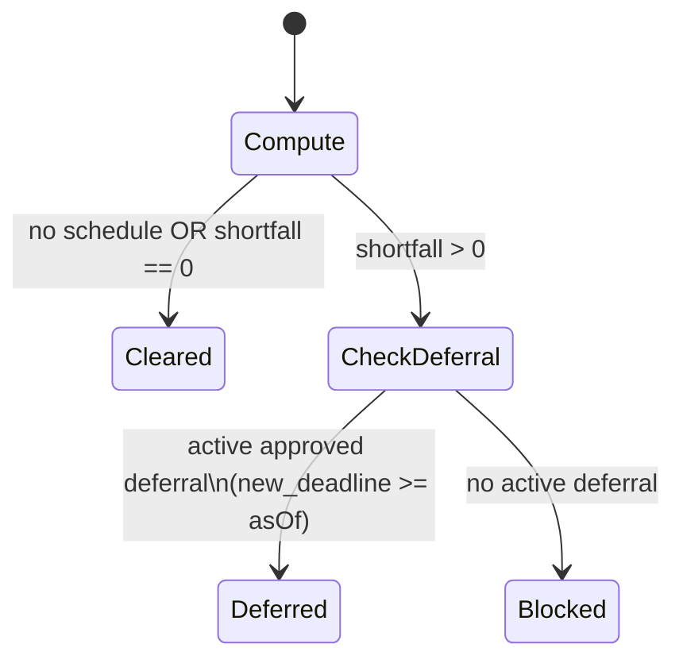
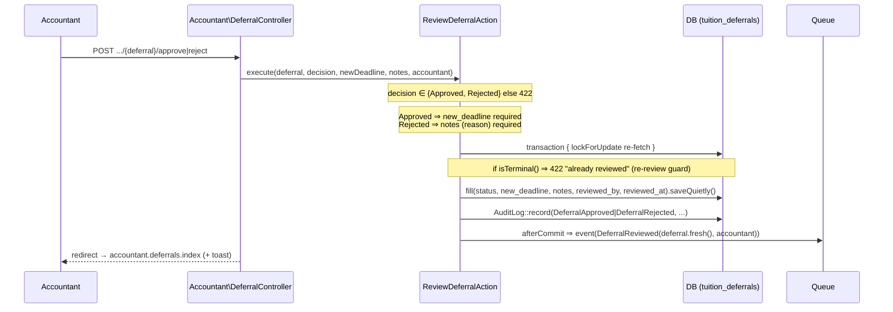
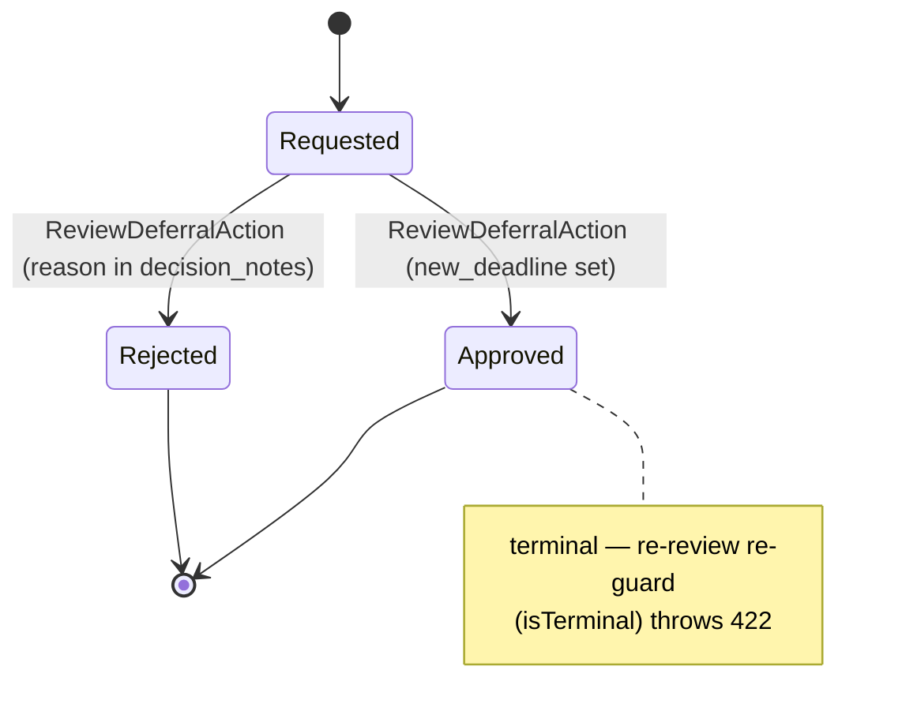

# Payment standing & tuition deferrals

How SchuLyf decides whether a student is *cleared* to sit exams and use gated facilities, and how a
student who is short on tuition asks the accounts office for more time. Every claim here is verified
against the shipped code (GitHub #8, plan `plan/exam-gating/plan.md`); where the plan and the code
disagree the code wins and the drift is called out.

> Cross-references: [architecture.md](../architecture.md) (request lifecycle, layering),
> [data-model.md](../data-model.md) (column detail), [routes.md](../routes.md) (endpoint inventory),
> [security.md](../security.md) (gates, audit log), [testing.md](../testing.md) (suite layout), and
> [modules/payments.md](payments.md) — this module **consumes** the #6 fee schedule, installment
> due-dates, and validated-payment totals; it does not own them.

---

## 1. Purpose

In the modelled university, exam-hall and facility access during the exam period is restricted to
students who have paid enough of their tuition. Tuition is paid in installments, each with a defined
amount and a deadline; once a deadline passes, a student whose *validated* payments fall below the
cumulative amount-due is no longer cleared — **unless an accountant grants a payment deferral** that
buys them more time.

This module is the **gate rule**, not the gate enforcer. A single service computes a live
*payment standing* (`Cleared` / `Blocked` / `Deferred`) from the fee schedule, validated payments,
and any active deferral. That standing is **informational**: it is shown to the student, surfaced to
gate-facing staff via a matricule lookup, and never mutates the student's enrollment. Enrollment
remains SAO-owned and decoupled (see [the admissions module] once published). A blocked student can
request a `TuitionDeferral`; an accountant approves it (with an extended deadline) or rejects it.

---

## 2. Roles & abilities

This module is guarded entirely by the **`role:` middleware** (`EnsureUserHasRole`) plus per-resource
ownership checks — the app has no ability gates (they were retired in
[ADR-0025](../adr/0025-retire-ability-gates.md)). The relevant audit actions (`DeferralApproved`,
`DeferralRejected`) are recorded.

| Action | Who | Guard |
|---|---|---|
| View own standing + deferral history | Student | `role:student,admin` (the `routes/student.php` group) |
| Request a deferral | Student | `role:student,admin` + a "has a `studentProfile`" check in the controller |
| Look up any student's standing by matricule | SAO, Accountant, Admin | `role:sao,accountant,admin` on `GET /standing` |
| Browse / review the deferral queue (approve / reject) | Accountant, Admin | `role:accountant,admin` (the `routes/accountant.php` group) |

Admin is on every surface by virtue of being named in each middleware list (mirroring the
"Admin-on-every-gate" posture in [security.md](../security.md) §2). The standing lookup is
deliberately **staff-only and authenticated** — it reveals who is behind on fees — unlike the public
HMAC receipt verifier in the payments module.

---

## 3. Data model

This module owns exactly **one** table, `tuition_deferrals` (model `App\Models\TuitionDeferral`).
It *reads* three tables owned by the payments module (`fee_schedules`, `fee_installments`,
`payment_submissions`) and one column on `student_profiles`. See [data-model.md](../data-model.md)
for full column detail.

### `tuition_deferrals`

One row per deferral request. `use RecordsAudit` + `SoftDeletes`.

| Column | Type | Role |
|---|---|---|
| `student_profile_id` | FK → `student_profiles` (`restrictOnDelete`) | the requesting student |
| `academic_year` | string | snapshotted from the enrollment at request time, so standing scopes deferrals to the right year |
| `reason` | text | student's justification (required) |
| `requested_new_deadline` | date, nullable | the student's *desired* date (advisory only — the accountant sets the binding one) |
| `status` | string, cast `DeferralStatus` (default `requested`) | `requested` → `approved`/`rejected` |
| `new_deadline` | date, nullable | **set on approval only** — the date until which the gate is lifted; the field the standing engine reads |
| `reviewed_by` | FK → `users` (`nullOnDelete`), nullable | the deciding accountant |
| `reviewed_at` | timestamp, nullable | decision timestamp |
| `decision_notes` | text, nullable | required on reject (rejection reason); optional on approve |

Relations: `studentProfile()` (belongs-to), `reviewer()` (belongs-to `User` on `reviewed_by`).

Indexes: `(status, created_at)` backs the accountant queue (`WHERE status = ? ORDER BY created_at`);
`(student_profile_id, status)` backs the student's own list, the duplicate-open-request guard, and
the active-deferral lookup in the standing engine.

Two model helpers carry the lifecycle invariant:

- `isTerminal()` → delegates to `DeferralStatus::isTerminal()` (`true` for anything other than
  `Requested`). Used as the re-review guard.
- `scopeActiveAsOf($asOf)` → `status = approved AND new_deadline >= asOf`. This scope **is** the
  "active deferral lifts the gate" rule; the standing engine calls it.

### Enums

| Enum | Cases (`->value` is lowercase) | Notes |
|---|---|---|
| `App\Enums\DeferralStatus` | `Requested` = `requested`, `Approved` = `approved`, `Rejected` = `rejected` | `label()` + `isTerminal()` (`!== Requested`) |
| `App\Enums\PaymentStanding` | `Cleared` = `cleared`, `Blocked` = `blocked`, `Deferred` = `deferred` | **computed only, never persisted**; `label()` only |

Both enums use **lowercase string `->value`** (TitleCase case keys), consistent with the course-status
convention noted in [architecture.md](../architecture.md). The Vue pages key their status maps off
these lowercase values.

---

## 4. Routes & screens

| Method · URI | Name | Controller | Inertia page | Role |
|---|---|---|---|---|
| `POST /student/deferrals` | `student.deferrals.store` | `Student\DeferralController@store` | — (redirects back) | student, admin |
| `GET /student/payments` | `student.payments.index` | `Student\PaymentController@index` | `student/payments/Index` | student, admin |
| `GET /standing` | `standing.check` | `StandingController` (invokable) | `staff/StandingCheck` | sao, accountant, admin |
| `GET /accountant/deferrals` | `accountant.deferrals.index` | `Accountant\DeferralController@index` | `accountant/deferrals/Index` | accountant, admin |
| `GET /accountant/deferrals/{deferral}` | `accountant.deferrals.show` | `Accountant\DeferralController@show` | `accountant/deferrals/Review` | accountant, admin |
| `POST /accountant/deferrals/{deferral}/approve` | `accountant.deferrals.approve` | `Accountant\DeferralController@approve` | — (redirects to index) | accountant, admin |
| `POST /accountant/deferrals/{deferral}/reject` | `accountant.deferrals.reject` | `Accountant\DeferralController@reject` | — (redirects to index) | accountant, admin |

Notes:

- **There is no `GET /student/deferrals` page.** The student requests a deferral from the
  `student/payments/Index` screen (a "Request deferral" CTA shown when standing is `Blocked`), and
  their deferral history rides along in that same page's `deferrals` prop. The student
  controller exposes only `store`.
- `GET /standing` lives in `routes/web.php` (inside the `['auth','verified']` group), **not** in a
  per-role route file, with the `role:sao,accountant,admin` middleware attached at the route level.
  With no `matricule` query it renders an empty lookup form; with one it renders the result (or
  `{ found: false }` for an unknown matricule — no enumeration oracle beyond presence).
- The accountant queue defaults to the actionable `Requested` rows but accepts a `status[]` filter
  (validated against `DeferralStatus::cases()`), plus `sort_order` (`created_at` only), `rows`
  (5–100), and `page`.

---

## 5. Flows

### 5.1 The standing rule — `PaymentStandingService`

`PaymentStandingService::for(StudentProfile $profile, ?CarbonInterface $asOf = null)` is the single
source of truth. `$asOf` defaults to `Carbon::now()`. It returns an immutable
`App\Support\PaymentStandingResult` and **never writes anything** — standing is computed live on
every read because it depends on today's date.

```
asOf            = $asOf ?? now()
schedule        = FeeSchedule WHERE (program_offering_id, level, academic_year) matches the profile
required_so_far = Σ FeeInstallment.amount_xaf WHERE fee_schedule_id = schedule AND due_date <= asOf
validated_paid  = Σ PaymentSubmission.amount_xaf
                  WHERE student_profile_id = profile AND academic_year = profile.academic_year
                                                     AND status = Validated
shortfall       = max(required_so_far - validated_paid, 0)
```

Decision (in order):

1. **No schedule configured** → `Cleared` (`hasSchedule: false`, all figures `0`). Nothing is yet
   defined as owed.
2. **`shortfall == 0`** → `Cleared`. (Also covers "no installment due yet": `required_so_far` is
   `0` because every `due_date` is in the future.)
3. **`shortfall > 0`** and an **active deferral exists** — `TuitionDeferral` for this student-year,
   `activeAsOf($asOf)` (status `approved` AND `new_deadline >= asOf`), taking `MAX(new_deadline)` →
   `Deferred`, exposing `active_deferral_deadline`.
4. **`shortfall > 0`** and no active deferral → `Blocked`.



`PaymentStandingResult` carries `{ standing, has_schedule, total_xaf, required_so_far,
validated_paid, shortfall, active_deferral_deadline? }` via `toArray()` (lowercase enum value for
`standing`), so the UI can explain *why* and *how much to pay*.

> **The decoupling guarantee.** The service performs only `SELECT`/`SUM` queries. It does **not**
> touch `student_profiles.status` or any enrollment state. A `Blocked` standing changes nothing on
> the student's record — it is a read-time verdict. Enrollment stays SAO-owned.

### 5.2 Deferral request — `Student\DeferralController@store`

Validated by `StoreDeferralRequest`: `reason` required (`max:1000`); `requested_new_deadline`
nullable, `date`, `after:today`. The controller then:

1. Rejects the request (validation error on `reason`) if the user has **no `studentProfile`**.
2. Enforces **one open request per student-year**: if a `Requested` row already exists for
   `(student_profile_id, academic_year)`, throws a validation error on `reason`. A new request is
   allowed once the previous one is decided (`Approved`/`Rejected`).
3. `TuitionDeferral::create(...)` with `status = Requested`, `academic_year` snapshotted from the
   profile. The model's `RecordsAudit` writes the `Created` audit row (request creation is **not** a
   bespoke audit action).
4. Flashes a success toast and redirects `back()`.

### 5.3 Deferral review — `ReviewDeferralAction`

Both `approve` and `reject` on `Accountant\DeferralController` delegate to
`App\Actions\Accountant\ReviewDeferralAction::execute(...)`. The controller passes the already-
validated request data (`ApproveDeferralRequest`: `new_deadline` required + `date` + `after:today`,
`decision_notes` nullable max 500; `RejectDeferralRequest`: `decision_notes` required max 500). The
action re-validates the business invariants itself so it is safe in isolation.



Guards inside the transaction (mirroring `ReviewPaymentAction` in the payments module):

- **Decision whitelist** — only `Approved` / `Rejected` accepted, else `422`.
- **Approval requires `new_deadline`** (non-empty); **rejection requires `decision_notes`** (the
  reason). On approve, `new_deadline` is parsed to a date string; on reject it is forced to `null`.
- **`lockForUpdate()` re-fetch** of the row inside `DB::transaction`, then a **terminal re-guard**:
  `if ($deferral->isTerminal()) → 422 "already reviewed"`. Two concurrent reviews cannot
  double-decide.
- Write is `saveQuietly()` (the audit row + event are emitted explicitly, so the model's own
  `updated` hook is intentionally bypassed).
- The `DeferralReviewed` event is dispatched **after commit**, with a `fresh()` reload, so the
  emailed copy reflects the persisted decision.



An approved deferral only lifts the gate while `new_deadline >= today`; once it lapses, the student
falls back to `Blocked` (the service uses `activeAsOf`, so an expired or merely-`Requested` deferral
does not count).

---

## 6. Side effects

### Audit (`App\Models\AuditLog`)

| Trigger | `AuditAction` | Subject | Context |
|---|---|---|---|
| Student creates a request | `Created` | the `TuitionDeferral` (via `RecordsAudit`) | model snapshot |
| Accountant approves | `DeferralApproved` | the `TuitionDeferral` | `{ status, new_deadline, notes }`, `user_id` = accountant |
| Accountant rejects | `DeferralRejected` | the `TuitionDeferral` | `{ status, new_deadline: null, notes }`, `user_id` = accountant |

Both decision rows are written explicitly inside the action's transaction (the model write is
`saveQuietly`, so there is **no** `Updated` audit row for the decision — the bespoke action row is
the record). See [security.md](../security.md) §3 for the immutable-log mechanics.

### Events / listeners / mail

- **Event:** `App\Events\DeferralReviewed($deferral, $reviewedBy)` — fired once per terminal
  decision, `afterCommit`.
- **Listener:** `App\Listeners\SendDeferralReviewedNotification` (`implements ShouldQueue`,
  auto-discovered). Resolves the student email via
  `deferral->studentProfile?->user?->email`; **returns silently if null** (no email, no error).
- **Mail:** `App\Mail\DeferralReviewedMail` (`Queueable`), markdown view `mail.deferral-reviewed`.
  Subject is `"{app.name} — deferral request approved|rejected"`. Exactly one email per decision.

There is **no in-app notification** and **no email on request creation** — the only notification in
this module is the decision email to the student. (Lecturer-absence notifications, the in-app
`notifications` table pattern, live in a separate module.)

### Dashboard

`Dashboards\AccountantDashboardController` exposes `deferralCounts` (a per-`DeferralStatus` tally) to
`dashboards/Accountant`, so the accountant sees the pending-request count alongside payments.

---

## 7. Tests

All green in the Pest suite (see [testing.md](../testing.md)).

| File | Covers |
|---|---|
| `tests/Feature/Payments/PaymentStandingTest.php` | The service across every branch: no schedule → `Cleared`; nothing due yet → `Cleared`; short → `Blocked` (with figures); covered → `Cleared`; **only validated payments count** (submitted ignored); only past-due installments summed; active approved deferral → `Deferred`; expired deferral → `Blocked`; merely-`Requested` deferral → `Blocked`. Uses a fixed `AS_OF` to pin the date-dependent logic. |
| `tests/Feature/Standing/StandingCheckTest.php` | Standing + deferral list in the student payments payload; staff matricule lookup (found/`Blocked`); unknown matricule → `found: false`; empty-query page; **non-staff roles forbidden** (student/lecturer/applicant); guests redirected to login. |
| `tests/Feature/Student/RequestDeferralTest.php` | Successful request → `Requested`; reason required; past desired-deadline rejected; **duplicate open request refused**; new request allowed after a decision; refused without enrollment; non-student/non-admin forbidden. |
| `tests/Feature/Accountant/ReviewDeferralTest.php` | Approve (sets deadline, audits `DeferralApproved`, emails student); deadline required + past-deadline rejected; reject (reason required, audits `DeferralRejected`); **re-review guard** (second decision → `status` error, still one email); queue + dashboard counts render; admin may approve; non-accountant/non-admin forbidden across the surface. |

---

## 8. File map

| File | Role |
|---|---|
| `app/Services/PaymentStandingService.php` | **The gate rule.** Computes live standing; read-only |
| `app/Support/PaymentStandingResult.php` | Immutable result DTO (`toArray()` shape) |
| `app/Enums/PaymentStanding.php` | `Cleared` / `Blocked` / `Deferred` (computed, never stored) |
| `app/Enums/DeferralStatus.php` | `Requested` / `Approved` / `Rejected` + `isTerminal()` |
| `app/Models/TuitionDeferral.php` | The one owned model; `activeAsOf` scope, `isTerminal`, audit + soft deletes |
| `database/migrations/2026_06_13_232622_create_tuition_deferrals_table.php` | Table + the two query indexes |
| `database/factories/TuitionDeferralFactory.php` | `requested()` / `approved()` / `rejected()` states |
| `app/Http/Controllers/Student/DeferralController.php` | `store` — request + duplicate guard |
| `app/Http/Requests/Student/StoreDeferralRequest.php` | request validation (reason, desired deadline) |
| `app/Http/Controllers/Accountant/DeferralController.php` | queue `index`, `show`, `approve`, `reject` |
| `app/Http/Requests/Accountant/ApproveDeferralRequest.php` | `new_deadline` required + future |
| `app/Http/Requests/Accountant/RejectDeferralRequest.php` | `decision_notes` (reason) required |
| `app/Actions/Accountant/ReviewDeferralAction.php` | the transition: lock + re-guard + audit + queued mail |
| `app/Http/Controllers/StandingController.php` | invokable staff matricule lookup |
| `app/Http/Controllers/Student/PaymentController.php` | injects standing + deferral list into `student/payments/Index` |
| `app/Events/DeferralReviewed.php` | fired after commit, once per decision |
| `app/Listeners/SendDeferralReviewedNotification.php` | queued; emails the student |
| `app/Mail/DeferralReviewedMail.php` | the decision email (`mail.deferral-reviewed`) |
| `resources/js/pages/staff/StandingCheck.vue` | staff lookup screen |
| `resources/js/pages/student/payments/Index.vue` | standing badge + figures + "Request deferral" CTA + history |
| `resources/js/pages/accountant/deferrals/Index.vue` | review queue |
| `resources/js/pages/accountant/deferrals/Review.vue` | request detail + approve/reject form |
| `routes/student.php` · `routes/accountant.php` · `routes/web.php` | route definitions (`student.deferrals.*`, `accountant.deferrals.*`, `standing.check`) |

---

*Sources verified: `app/Services/PaymentStandingService.php`, `app/Support/PaymentStandingResult.php`,
`app/Models/TuitionDeferral.php`, `app/Enums/{DeferralStatus,PaymentStanding}.php`,
`app/Actions/Accountant/ReviewDeferralAction.php`, `app/Http/Controllers/StandingController.php`,
`app/Http/Controllers/{Student,Accountant}/DeferralController.php`,
`app/Http/Controllers/Student/PaymentController.php`,
`app/Http/Requests/Student/StoreDeferralRequest.php`,
`app/Http/Requests/Accountant/{Approve,Reject}DeferralRequest.php`,
`app/Events/DeferralReviewed.php`, `app/Listeners/SendDeferralReviewedNotification.php`,
`app/Mail/DeferralReviewedMail.php`,
`app/Http/Controllers/Dashboards/AccountantDashboardController.php`,
`database/migrations/2026_06_13_232622_create_tuition_deferrals_table.php`,
`routes/{web,student,accountant}.php`, and the four Pest files in §7.*
