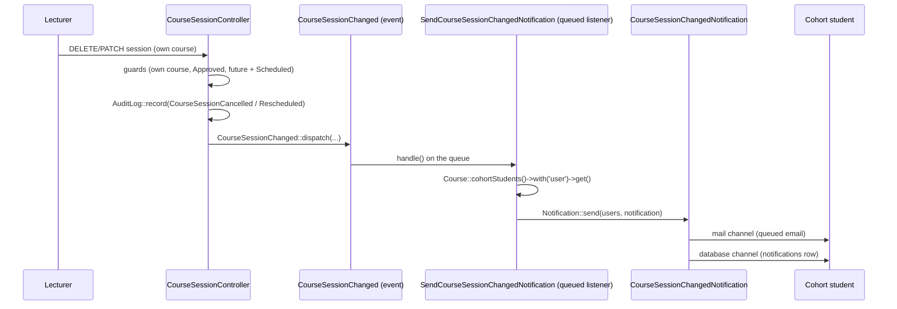

# Notifications & the channel strategy

How SchuLyf reaches users out-of-band: the two outbound channels it ships, the one multi-channel
in-app notification built so far, the student in-app feed that surfaces it, and the decision boundary
that governs which channel a future notification should use. Every claim here is verified against the
code as it stands; the channel decision itself (GitHub **#18**) is recorded as an architectural choice
rather than a piece of UI.

> Cross-references: [architecture.md](../architecture.md) (event/listener layering, queue),
> [data-model.md](../data-model.md) (the `notifications` table), [routes.md](../routes.md)
> (the student feed endpoints), [security.md](../security.md) (audit trail, role gates),
> [testing.md](../testing.md) (the Pest suites), and
> [modules/course-management.md](course-management.md) (the lecturer action that fires the only
> multi-channel notification today).

---

## 1. Purpose

Students in the source institution lose information because it travels by word of mouth — a lecturer's
absence is relayed late or distrusted, and a payment/admission outcome arrives (or doesn't) by an
unreliable channel. This module is the app's answer: a small, deliberate **two-channel** delivery
layer. Transactional 1:1 outcomes (you were admitted, your payment was validated) go out as **email**
through Mailables; cohort broadcasts and anything that should also appear inside the app
(a session was cancelled) go out as **in-app database notifications** through Laravel's Notifications
system, fanned out by a queued listener. SMS and per-user channel preferences are deliberately
deferred (§7).

---

## 2. Roles & abilities

This module has no ability gates of its own — it is a side effect of actions that are gated elsewhere.
The relevant authorization lives at the **trigger** and the **feed**:

| Surface | Who | Guard |
|---|---|---|
| Firing a session-change notification | Lecturer (course owner), Admin | The trigger is `CourseSessionController::destroy/update`, guarded by `authorizeOwnership()` (lecturer must own the course) + `guardApproved()` — see [course-management.md](course-management.md). A non-owning lecturer gets `403` and **no one is notified**. |
| Receiving an in-app notification | Active cohort students | Recipient set = `Course::cohortStudents()` (implicit cohort: matching `program_offering_id` + `level` + `academic_year` + `status = Active`). Inactive/graduated cohort-matching students are excluded. |
| Reading the in-app feed | Student, Admin | `routes/student.php` group middleware `['auth', 'verified', 'role:student,admin']`. |
| Marking a single notification read | The owner only | `NotificationController::markAsRead` aborts `403` unless `notifiable_id` **and** `notifiable_type` match the authenticated user (per-resource ownership check, not a Gate). |

Email recipients are addressed directly by the listener (no in-app role) — the application's
`contact_email`, or the student/account `user->email`.

See [security.md](../security.md) §2 for the gate/middleware machinery and §3 for the audit trail
these triggers also write.

---

## 3. Data model & channels

### 3.1 The two channels (#18)

| Channel | Mechanism | Used for | Persistence |
|---|---|---|---|
| **Email** | `App\Mail\*` Mailables, sent from queued listeners | Transactional **1:1 outcomes** | None (fire-and-forget mail) |
| **In-app** | `Illuminate\Notifications\Notification` on the `database` channel | **Broadcasts / cohort fan-out** + anything to surface in-app | `notifications` table |
| ~~SMS~~ | — | — | **Deferred** (§7) |

A single notification may use **both** channels at once: the in-app notification
`CourseSessionChangedNotification` returns `['mail', 'database']` from `via()`, so each recipient gets
a queued email **and** a persisted in-app row from one dispatch.

### 3.2 The `notifications` table

Laravel's standard database-notifications table
(`database/migrations/2026_06_16_000001_create_notifications_table.php`):

| Column | Type | Role |
|---|---|---|
| `id` | `uuid` (PK) | Notification id |
| `type` | `string` | The notification class FQCN |
| `notifiable_type` / `notifiable_id` | `morphs` | Polymorphic owner — always a `User` here |
| `data` | `text` | JSON payload from the notification's `toArray()` |
| `read_at` | `timestamp` nullable | Null = unread |
| `created_at` / `updated_at` | timestamps | — |

`User` uses `Illuminate\Notifications\Notifiable`, which provides `notifications()`,
`unreadNotifications()`, and `notify()`. There is no custom model — `Illuminate\Notifications\DatabaseNotification`
is used directly (route-model-bound in the feed controller). See [data-model.md](../data-model.md).

> The `notifications` table is **not** the immutable `audit_logs` table. They are separate concerns:
> the audit log is an append-only forensic trail (see [security.md](../security.md) §3); notifications
> are user-facing and **mutable** (`read_at` flips). Many triggers write to both.

---

## 4. Routes & screens

### 4.1 The student in-app feed (`routes/student.php`)

| Method · URI | Name | Controller action | Behaviour |
|---|---|---|---|
| `POST student/notifications/{notification}/read` | `student.notifications.read` | `Student\NotificationController@markAsRead` | Marks one notification read; `403` unless owner; flashes a success toast; `back()`. |
| `POST student/notifications/read-all` | `student.notifications.read-all` | `Student\NotificationController@markAllAsRead` | `$user->unreadNotifications->markAsRead()` in one shot; flashes toast; `back()`. |

Both are `POST` (state-changing), session-authenticated, and redirect back — there is no standalone
notifications page. The feed is **read** on the student dashboard, not through these routes.

### 4.2 Where the feed renders

`Dashboards\StudentDashboardController@index` ships the feed as Inertia props to
`resources/js/pages/dashboards/Student.vue`:

- `notifications` — the latest **10** rows (`$user->notifications()->latest()->limit(10)`), each
  shaped `{ id, data, read_at, created_at }`.
- `unreadCount` — `$user->unreadNotifications()->count()`, the unread badge source.

There is no other-role feed and no dedicated notifications-centre page — both are out of scope (§7).

---

## 5. Flows — event → queued listener → channels

The standard going forward (#18): a domain action dispatches an **event**; a **queued listener**
(`ShouldQueue`, auto-discovered — there is no `EventServiceProvider`, this is Laravel 13 listener
auto-discovery) does the fan-out and channel dispatch on the worker. The auth-event audit listeners
are the one exception, wired explicitly in `AppServiceProvider::configureAuditListeners()`.

### 5.1 The multi-channel path — `CourseSessionChangedNotification`

The first and (today) only multi-channel notification. Fired when a lecturer **cancels** or
**reschedules** a future, currently-scheduled `CourseSession`.

**The trigger guards (the silent-vs-notify decision lives here, in the controller, not the listener):**

| Transition | Action / method | Guarded invariant — notifies only when… |
|---|---|---|
| Cancel | `CourseSessionController::destroy` (`CancelCourseSessionRequest`) | `status === Scheduled` **and** `scheduled_for->isFuture()`. The status flips to `Cancelled` and the audit row writes **unconditionally**; the `CourseSessionChanged` dispatch is gated by `$shouldNotify`. Re-cancelling an already-`Cancelled` session, or cancelling a **past** session, audits but **sends nothing**. |
| Reschedule | `CourseSessionController::update` (`UpdateCourseSessionRequest`) | `status === Scheduled` **and** `scheduled_for` actually changed (`! ->equalTo($previous)`) **and** new time `isFuture()`. A **topic/duration-only edit sends nothing** (the time didn't move). When it does fire, it carries `previousScheduledFor` and writes `AuditAction::CourseSessionRescheduled`. |

**The listener fan-out** (`SendCourseSessionChangedNotification::handle`, queued):

- Resolves recipients from `$event->session->course->cohortStudents()->with('user:id,name,email')`,
  plucks the `user`, and `->filter()`s out cohort rows with no linked user.
- Returns early if the recipient set is empty (no notification, no error).
- `Notification::send($users, new CourseSessionChangedNotification(...))` — one notification, both
  channels, per recipient.

**The notification payloads** (`CourseSessionChangedNotification`):

- `via()` returns exactly **`['mail', 'database']`** — confirmed against the source and the test.
- `toMail()` renders `mail.course-session-changed` with subject `"<app> — <course code> session
  cancelled|rescheduled"`.
- `toArray()` (the in-app payload — the student UI and tests depend on this exact shape):
  `{ type, course_id, course_code, course_title, session_id, scheduled_for (ISO-8601), reason,
  previous_scheduled_for (ISO-8601|null) }`. `type` is the **lowercase** `SessionChangeType->value`
  (`cancelled` / `rescheduled`).

`SessionChangeType` (string enum) has two cases: `Cancelled = 'cancelled'`, `Rescheduled =
'rescheduled'` — lowercase values, matching the course-management status convention.

### 5.2 The email-only paths — the five transactional Mailables

These predate Laravel Notifications and remain the **email** channel for 1:1 outcomes. Each is sent by
a queued listener on a domain event (except the invite, which is queued directly from an action). Each
fires **once per outcome** (for the documents-requested mail, once per request round):

| Mailable | Dispatched by | Trigger → recipient |
|---|---|---|
| `ApplicationDecisionMail` | `SendApplicationDecisionNotification` ← `ApplicationDecided` | SAO/Admin decides an application (or restore-prior merge) → the application's `contact_email`. |
| `ApplicationDocumentsRequestedMail` | `SendDocumentsRequestedNotification` ← `ApplicationDocumentsRequested` | SAO/Admin triages an application into `DocumentsRequested` (after rejecting ≥1 document) → the application's `contact_email`; lists the rejected documents + review notes. |
| `PaymentReviewedMail` | `SendPaymentReviewedNotification` ← `PaymentReviewed` | Accountant/Admin validates or rejects a payment submission → the student's account email. |
| `DeferralReviewedMail` | `SendDeferralReviewedNotification` ← `DeferralReviewed` | Accountant/Admin approves or rejects a tuition deferral → the student's account email. |
| `UserInvitationMail` | `CreateUserAction` (`Mail::to(...)->queue(...)`) — **no event/listener** | Admin provisions a staff/admin user → the new user's email, carrying the single-use password-reset (first-login) link. See [security.md](../security.md) §1.5. |

> **Note on queueing the mail:** of the five, only `UserInvitationMail` is itself `ShouldQueue`. The
> other four Mailables are **not** `ShouldQueue` — but they are sent from listeners that **are**
> `ShouldQueue`, so the send still happens on the worker. Don't "fix" this by adding `ShouldQueue` to
> the Mailables without checking the listener, or the work double-queues.

---

## 6. Side effects (audit & dispatch)

Every state change behind a notification also writes the immutable audit trail
([security.md](../security.md) §3). The notification is the user-facing echo; the audit row is the
forensic record. They are decoupled — **the audit row is written even when the notification is
suppressed** by a guard.

| Trigger | `AuditAction` recorded | Notification fired? |
|---|---|---|
| Session cancelled (future, Scheduled) | `CourseSessionCancelled` | Yes — `CourseSessionChangedNotification` (mail + database) to cohort |
| Session cancelled (past or already-cancelled) | `CourseSessionCancelled` | **No** |
| Session rescheduled (time moved, future) | `CourseSessionRescheduled` | Yes — `CourseSessionChangedNotification` (mail + database) to cohort |
| Session edited (topic/duration only) | none (no audit, no notify) | **No** |
| Application decided | `ApplicationDecided` (via the admissions module) | Yes — `ApplicationDecisionMail` (email) |
| Application triaged into Documents requested | `StatusChanged` (via the admissions module) | Yes — `ApplicationDocumentsRequestedMail` (email) |
| Payment validated/rejected | `PaymentValidated` / `PaymentRejected` | Yes — `PaymentReviewedMail` (email) |
| Deferral approved/rejected | `DeferralApproved` / `DeferralRejected` | Yes — `DeferralReviewedMail` (email) |
| Staff user provisioned | `Created` (password redacted) | Yes — `UserInvitationMail` (email) |

Marking a notification read is **not** audited — it is routine, user-driven, and reversible only in
the trivial sense; it carries no forensic weight.

---

## 7. The channel decision (#18) — boundaries

GitHub **#18** locked the strategy (closed 2026-06-15). The rule for any **new** notification:

- **Email** = transactional, **1:1** outcomes addressed to a single known recipient (the five
  Mailables). Unchanged by #18.
- **In-app (database)** = **broadcasts / cohort fan-out**, and anything that should also be visible
  inside the app. Use `Illuminate\Notifications\Notification` with `via() => ['mail', 'database']`,
  dispatched through the **Event → queued Listener** convention (the `CourseSessionChangedNotification`
  pattern established by #12). Add the recipient model `Notifiable` if it isn't already.
- **SMS** = **deferred**. Not built.

**Explicitly out of scope** (future issues only if prioritised): SMS delivery, **per-user
notification preferences**, feeds for roles other than Student, and a standalone notifications-centre
page. Today the in-app feed is the student dashboard's 10-row list only.

---

## 8. Tests

| File | Covers |
|---|---|
| `tests/Feature/Courses/CourseSessionNotificationTest.php` | The full trigger matrix: cancel & reschedule notify each active cohort student on **both** `mail` and `database` (asserting `via()` channels and `SessionChangeType`); reschedule carries `previousScheduledFor`; **sends nothing** for topic/duration-only edits, already-cancelled sessions, past sessions, or a non-owning lecturer (`403`); excludes out-of-cohort and inactive cohort-matching students; asserts the matching `AuditAction` rows. |
| `tests/Feature/Notifications/StudentNotificationTest.php` | The in-app feed routes: `markAsRead` flips `read_at` for the owner; `markAllAsRead` clears all unread; an intruder marking another student's notification gets `403` and the row stays unread. |
| `tests/Feature/Sao/ApplicationDecisionNotificationTest.php` | The `ApplicationDecisionMail` (email channel) decision path. |
| `tests/Feature/Sao/TriageApplicationTest.php` | Entry into `DocumentsRequested` sends `ApplicationDocumentsRequestedMail` to the `contact_email` (`Mail::assertSent`); no mail for the other triage moves. |

The session test uses `Notification::fake()`; the feed test uses `Mail::fake()` so `notify()` still
persists the database row synchronously under `QUEUE_CONNECTION=sync`. See [testing.md](../testing.md).

---

## 9. File map

| File | Role |
|---|---|
| `app/Notifications/CourseSessionChangedNotification.php` | The one multi-channel notification — `via() => ['mail','database']`, `toMail()`, `toArray()` payload |
| `app/Events/CourseSessionChanged.php` | Event carrying session + `SessionChangeType` + reason + previous time |
| `app/Listeners/SendCourseSessionChangedNotification.php` | Queued listener — cohort fan-out + `Notification::send` |
| `app/Http/Controllers/Lecturer/CourseSessionController.php` | The trigger — `destroy`/`update` hold the notify-vs-silent guards |
| `app/Enums/SessionChangeType.php` | `Cancelled` / `Rescheduled` (lowercase values) |
| `app/Http/Controllers/Student/NotificationController.php` | Feed write endpoints — `markAsRead` (owner `403`), `markAllAsRead` |
| `app/Http/Controllers/Dashboards/StudentDashboardController.php` | Surfaces the feed (`notifications` 10-row + `unreadCount`) to the dashboard |
| `routes/student.php` | `student.notifications.read` / `.read-all` route definitions |
| `database/migrations/2026_06_16_000001_create_notifications_table.php` | Standard `notifications` table |
| `resources/views/mail/course-session-changed.blade.php` | Markdown mail body for the session-change email |
| `app/Mail/ApplicationDecisionMail.php` + `app/Listeners/SendApplicationDecisionNotification.php` | Email channel — admission outcome |
| `app/Mail/PaymentReviewedMail.php` + `app/Listeners/SendPaymentReviewedNotification.php` | Email channel — payment outcome |
| `app/Mail/DeferralReviewedMail.php` + `app/Listeners/SendDeferralReviewedNotification.php` | Email channel — deferral outcome |
| `app/Mail/UserInvitationMail.php` (queued from `app/Actions/Admin/CreateUserAction.php`) | Email channel — staff invite / first-login link |
| `app/Models/Course.php` (`cohortStudents()`) | Defines the implicit cohort = the recipient set |
| `app/Models/User.php` (`Notifiable`) | Gives users `notifications()` / `unreadNotifications()` / `notify()` |
| `tests/Feature/Courses/CourseSessionNotificationTest.php`, `tests/Feature/Notifications/StudentNotificationTest.php` | The two primary Pest suites |

---

*Sources verified: `app/Notifications/CourseSessionChangedNotification.php`,
`app/Events/CourseSessionChanged.php`, `app/Listeners/SendCourseSessionChangedNotification.php`,
`app/Listeners/Send{ApplicationDecision,PaymentReviewed,DeferralReviewed}Notification.php`,
`app/Http/Controllers/Lecturer/CourseSessionController.php`,
`app/Http/Controllers/Student/NotificationController.php`,
`app/Http/Controllers/Dashboards/StudentDashboardController.php`, `app/Enums/SessionChangeType.php`,
`app/Models/{Course,User}.php`, `app/Mail/*.php`, `app/Actions/Admin/CreateUserAction.php`,
`database/migrations/2026_06_16_000001_create_notifications_table.php`, `routes/student.php`,
`tests/Feature/Courses/CourseSessionNotificationTest.php`,
`tests/Feature/Notifications/StudentNotificationTest.php`, and `plan/context.md` §17 (#12, #18).*
